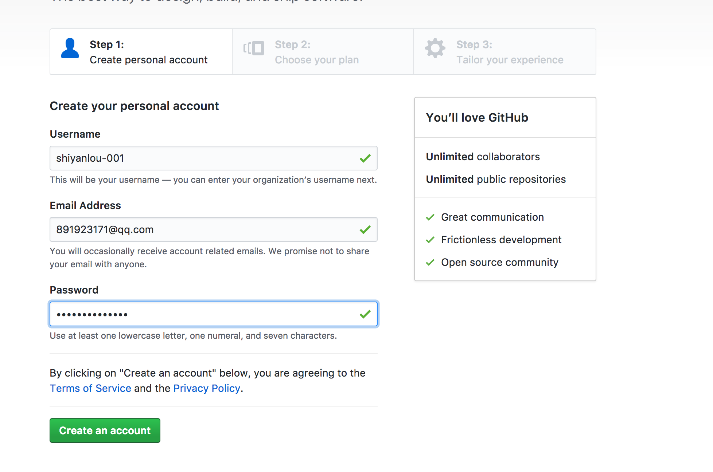
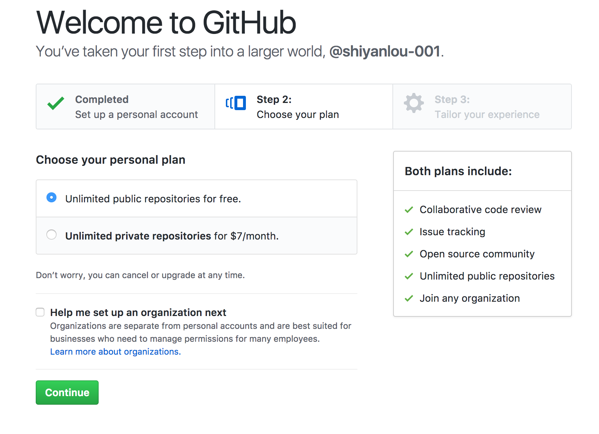
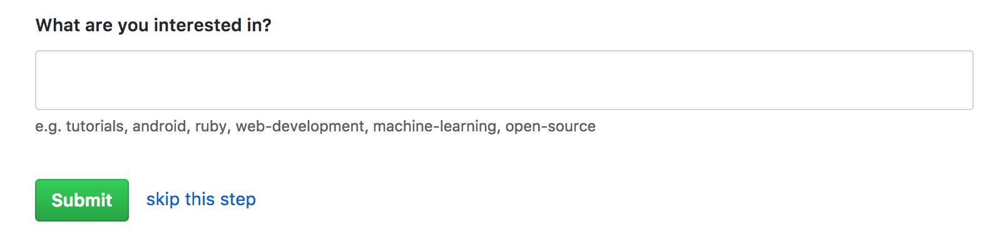
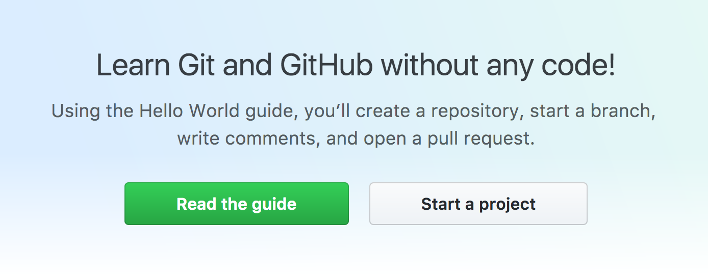
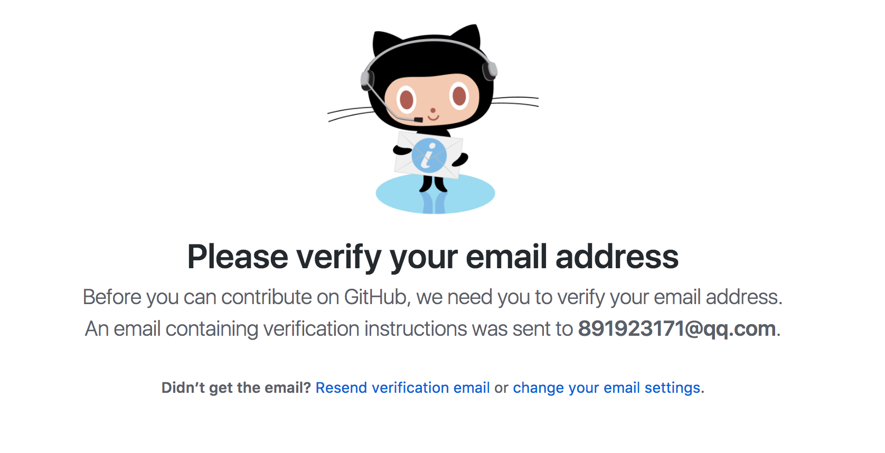
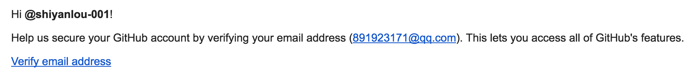
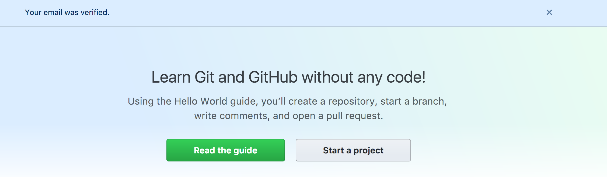
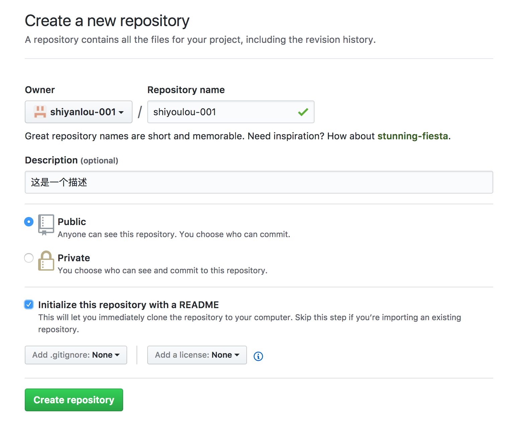
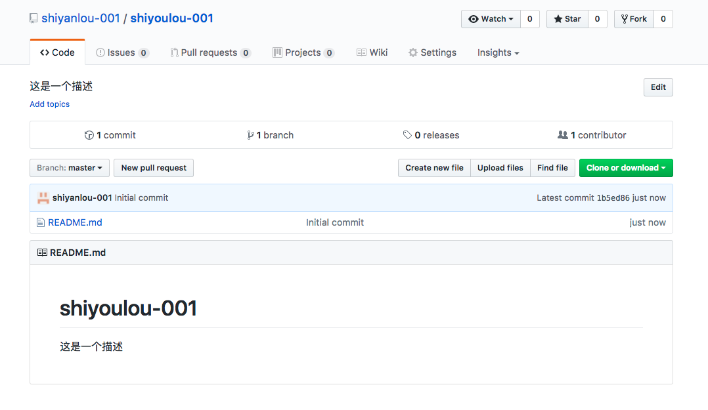

# Github 快速上手实战教程》

## 一、实验介绍

### 1.1 实验内容
本次课程讲的是在实验楼的在线实验室中，如何使用 [`Github`](https://github.com) 去管理在实验室中使用的代码、配置、资源等实验相关文件，怎样去添加、同步和下拉在远程仓库中的实验文件，以此来维持自身的实验进度。

### 1.2 实验知识点

+ `SSH` 公私钥的基本使用
+ [`Github`](https://github.com) 的基本使用
+ `Git` 工具的基本使用


### 1.3 实验环境
+ git:  `Git` 管理工具   
+ ssh-keygen：`SSH` 公私钥管理工具

### 1.4 适合人群
本课程难度为简单，属于基础级别课程，适合具有 `Bash` 命令行基础的用户。


## 二、实验准备

### 2.1 `Github` 的使用
讲解如何创建 `Github` 账户和如何创建远程仓库

#### 2.1.1 创建账号
到 `Github` [注册](https://github.com/join?source=header-home) 页面中注册

填写用户名、邮箱和密码


选择免费服务


步骤三可以根据自身喜好勾选或者直接跳过


#### 2.1.2 创建远程仓库
创建完账号后，可以开始创建仓库


但是这里我们还没有验证邮箱，所以点击开始一个项目会跳出一个页面让我们验证邮箱


到邮箱中点击验证链接


验证完毕后会跳到之前的 Guide 页面，而且顶部会有一个邮箱验证完毕的提示


再次点击开始一个项目，成功进入创建项目页面，填写项目名称和描述，勾选 Public（Private是收费选项） 选项和自动初始化 `README.md` 勾选框


点击创建，至此 `Github` 账号的创建和远程仓库创建完毕


### 2.2 `SSH` 公私钥的使用
讲解如何用 `ssh-keygen` 生成公私钥

#### 2.2.1 创建密钥
首先在终端敲入
```bash
$ ssh-keygen
```
如果一路一直按回车下去，会创建一套空密码验证的密钥文件，反之则每一次匹对公私钥都需要再手动输入一次密码

#### 2.2.2 关联公钥到 `Github` 账号下
pass

### 2.3 安装配置 `Git`工具
介绍如何安装与简单的配置 `Git` 工具

#### 2.3.1 安装
在终端敲入下面这条命令
```bash
$ sudo apt install git -y
```

#### 2.3.2 配置用户名与邮箱
配置用户名
```bash
### 如果想设置为全局生效，可以加上--global参数
$ git config user.name "你的用户名"
$ git config user.email "你的邮箱"
```

## 三、实验步骤
