# Github 快速上手实战教程

## 目录
* [一、实验介绍](#一实验介绍)
  * [1.1 实验内容](#11-实验内容)
  * [1.2 实验知识点](#12-实验知识点)
  * [1.3 实验环境](#13-实验环境)
  * [1.4 适合人群](#14-适合人群)
* [二、实验准备](#二实验准备)
  * [2.1 Github 的使用](#21-Github-的使用)
    * [2.1.1 创建账号](#211-创建账号)
    * [2.1.2 创建远程仓库](#212-创建远程仓库)
  * [2.2 SSH 公私钥的使用](#22-SSH-公私钥的使用)
    * [2.2.1 创建密钥](#221-创建密钥)
    * [2.2.2 关联公钥到 Github 账号下](#222-关联公钥到-Github-账号下)
  * [2.3 安装配置 Git 工具](#23-安装配置-Git-工具)
    * [2.3.1 安装](#231-安装)
    * [2.3.2 配置用户名与邮箱](#232-配置用户名与邮箱)
* [三、实验步骤](#三实验步骤)
  * [3.1 克隆远程仓库到本地](#31-克隆远程仓库到本地)
    * [3.1.1 克隆仓库到个人PC](#311-克隆仓库到个人PC)
    * [3.1.2 克隆仓库到在线实验室](#.12-克隆仓库到在线实验室)
  * [3.2 添加实验文件到索引库](#32-添加实验文件到索引库)
    * [3.2.1 添加／修改](#321-添加修改)
    * [3.2.2 删除](#322-删除)
    * [3.2.3 撤销](#323-撤销)
  * [3.3 提交仓库的改动](#33-提交仓库的改动)
  * [3.4 推送改动到远程仓库中](#34-推送改动到远程仓库中)
  * [3.5 在新的实验环境中同步之前的实验文件](#35-在新的实验环境中同步之前的实验文件)
  * [3.6 在个人计算机中同步实验室中的进度](#36-在个人计算机中同步实验室中的进度)
    * [3.6.1 查看仓库改动](#361-查看仓库改动)
    * [3.6.2 下拉仓库同步](#362-下拉仓库同步)
* [四、总结](#四总结)

## 一、实验介绍

### 1.1 实验内容
本次课程讲的是在实验楼的在线实验室中，如何使用 [`Github`](https://github.com) 去管理在实验室中使用的代码、配置、资源等实验相关文件，怎样去添加、同步和下拉在远程仓库中的实验文件，以此来维持自身的实验进度。

### 1.2 实验知识点

+ `SSH` 公私钥的基本使用
+ [`Github`](https://github.com) 的基本使用
+ `Git` 工具的基本使用


### 1.3 实验环境
+ git:  `Git` 管理工具   
+ ssh-keygen：`SSH` 公私钥管理工具
+ xfce终端

### 1.4 适合人群
本课程难度为简单，属于基础级别课程，适合具有 `Bash` 命令行基础的用户。


## 二、实验准备

### 2.1 Github 的使用
讲解如何创建 `Github` 账户和如何创建远程仓库

#### 2.1.1 创建账号
到 `Github` [注册](https://github.com/join?source=header-home) 页面中注册

填写用户名、邮箱和密码


选择免费服务


步骤三可以根据自身喜好勾选或者直接跳过


#### 2.1.2 创建远程仓库
创建完账号后，可以开始创建仓库


但是这里我们还没有验证邮箱，所以点击开始一个项目会跳出一个页面让我们验证邮箱


到邮箱中点击验证链接


验证完毕后会跳到之前的 Guide 页面，而且顶部会有一个邮箱验证完毕的提示


再次点击开始一个项目，成功进入创建项目页面，填写项目名称和描述，勾选 Public（Private是收费选项） 选项和自动初始化 `README.md` 勾选框


点击创建，至此 `Github` 账号的创建和远程仓库创建完毕


### 2.2 SSH 公私钥的使用
讲解如何使用 `ssh-keygen` 生成公私钥

#### 2.2.1 创建密钥
首先在终端敲入，如果一路一直按回车下去，会把密钥文件放置再默认路径，也就是 `~/.ssh/` 路径下，并且会创建一套空密码验证的密钥文件，反之则每一次匹对公私钥都需要再手动输入一次密码，所以这里为了方便使用，建议一路回车下去就行
```bash
$ ssh-keygen
```

输入密钥文件保存路径，建议默认路径，按回车跳过
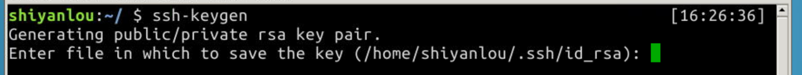

要求输入密码，建议回车使用空密码方便以后的每次连接
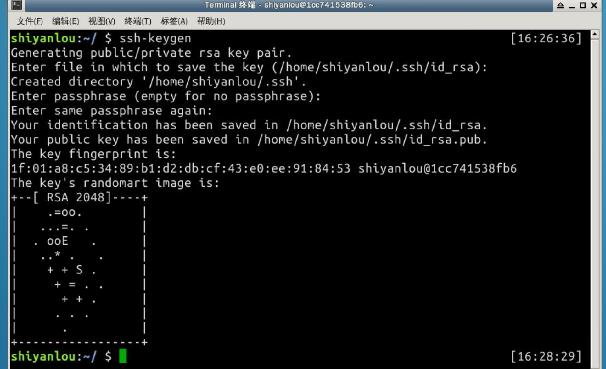

到选择存放密钥文件的路径下查看，我这里使用的使默认路径，所以使 `~/.ssh/` 路径下，可以看到生成了两个密钥文件，后缀为 `.pub` 的就是公钥文件，另一个没有后缀的就是私钥文件，可以看到密钥文件创建完毕
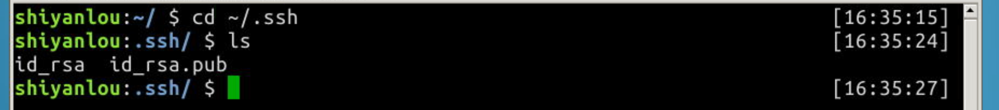


#### 2.2.2 关联公钥到 Github 账号下
首先复制公钥文件中的内容，也就是 `ssh-rsa` 开头到 `用户名@主机名` 这段字符串
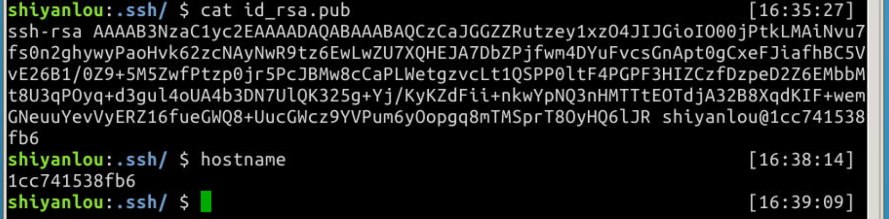

然后回到 `Github`, 点击右上角头像的下拉按钮，选择 `Settings`
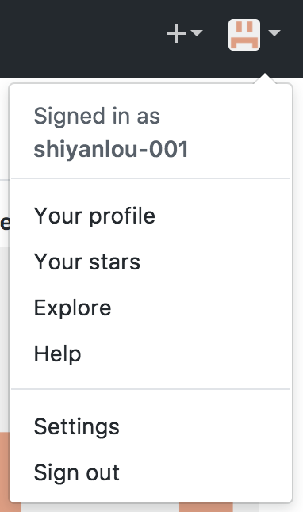

然后在 `Settings` 页面中选择左边菜单里的 `SSH and GPG keys`，然后点击右上角的 `New SSH key` 按钮，填写 `Title` 和 `Key`，然后点击 `Add SSH key` 按钮提交
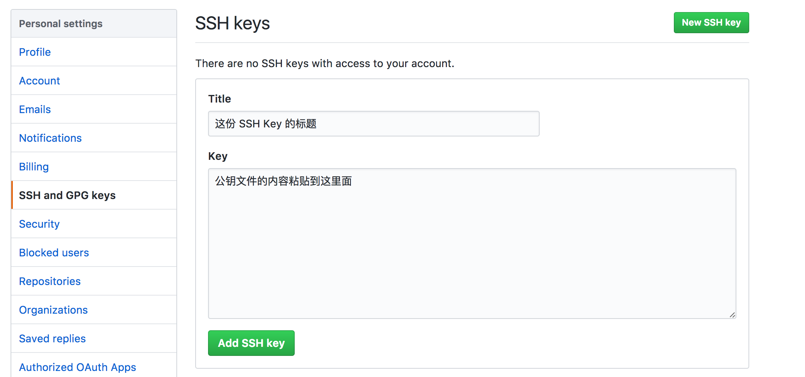

通过返回的页面可以看到公钥与 `Github` 已经关联完毕
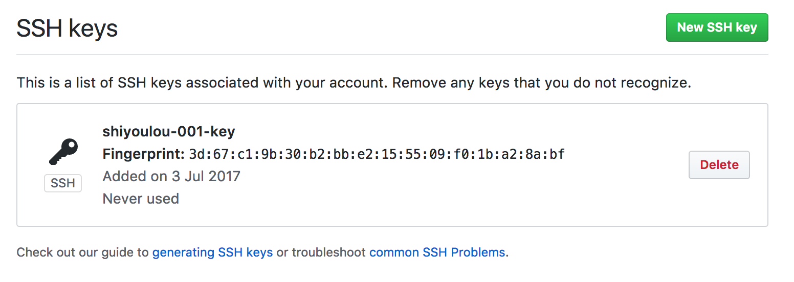

### 2.3 安装配置 Git 工具
介绍如何安装与简单的配置 `Git` 工具

#### 2.3.1 安装
首先在终端下面敲入 `git --version`， 如果正确回显版本号，则说明已经安装好，如果没有则在终端敲入下面这条命令进行安装
```bash
$ sudo apt install git -y
```

#### 2.3.2 配置用户名与邮箱
配置用户名
```bash
### 如果想设置为全局生效，可以加上--global参数
$ git config user.name "你的用户名"
$ git config user.email "你的邮箱"
```

## 三、实验步骤
### 3.1 克隆远程仓库到本地
#### 3.1.1 克隆仓库到个人PC
首先到远程仓库中，点击 `Clone or download` 按钮，选择使用 `Use SSH`，然后点击复制链接按钮
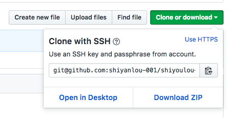

因为之前已经关联过个人PC的 `SSH` 公钥，所以直接在命令行中使用以下命令就可以克隆仓库到本地
```bash
#命令用法：git clone "你复制的仓库链接"
$ git clone git@github.com:shiyanlou-001/shiyoulou-001.git  
```

查看仓库内容，确定已经克隆到本地
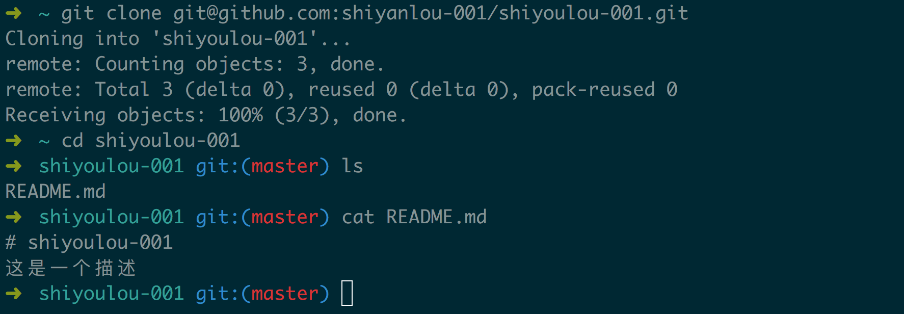

#### 3.1.2 克隆仓库到在线实验室
打开 `Xfce` 终端，输入以下命令克隆仓库到实验室中，这里要注意下，因为实验室环境的 `SSH` 公钥是没有关联 `Github` 账户的，所以这里克隆仓库到本地是需要对应上 `Github` 的用户名与密码的，具体操作如下

在实验环境中打开浏览器，输入远程仓库地址，`Github` 的URL地址构造是 `https://github.com/用户名/仓库名称`，而我的用户名和仓库名称都是 shiyanlou-001 所以这里我自己的项目地址为 `https://github.com/shiyanlou-001/shiyanlou-001`

进入仓库页面后，依旧是点击 `Clone or download` 按钮，由于我们没有登录 `Github` 所以这里能复制URL的只有 `Use HTTPS` 选项，与 `Use ssh` 选项的区别是每一次同步改动都需要手动输入 `Github` 的用户名和密码，加上因为是实验室环境，为了安全性这里也应该就只用 `HTTPS` 来克隆仓库到本地
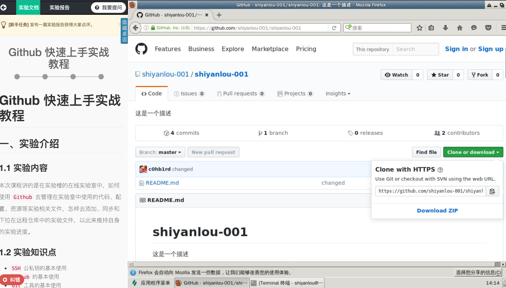

接下来打开终端，依旧用 `git clone` 命令克隆仓库到实验室中，比如我的仓库地址是 `https://github.com/shiyanlou-001/shiyanlou-001.git`，那么命令就应该是下面这样子
```bash
#注意地址用的是你自己的仓库地址
$ git clone https://github.com/shiyanlou-001/shiyanlou-001.git
```
查看仓库内容，确定已经克隆到实验室之中
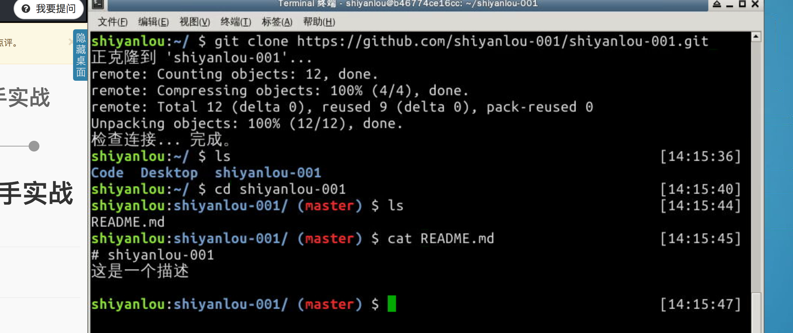

### 3.2 添加实验文件到索引库
#### 3.2.1 添加／修改
要把一个文件添加或者更新内容到本地索引中，可以使用 `git add` 命令，命令的用法是 `git add <文件名|路径名>`，具体步骤如下

创建一个新的 `txt` 文件，文件的内容就写“这是一个新的文件”
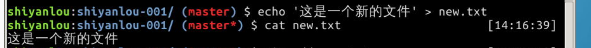

将这个文件移动到仓库下，并用 `git add` 命令添加到本地索引库中
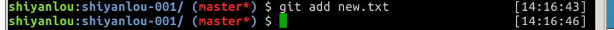

#### 3.2.2 删除
要把仓库里的文件删除掉，可以使用 `git rm` 命令，用法是 `git rm [-rf] <文件名|路径>`，具体步骤如下

这里我们可以用一开始就存在的 `README.md` 文件来做实验，我们敲入 `git rm README.md`，然后可以发现文件已经删除了
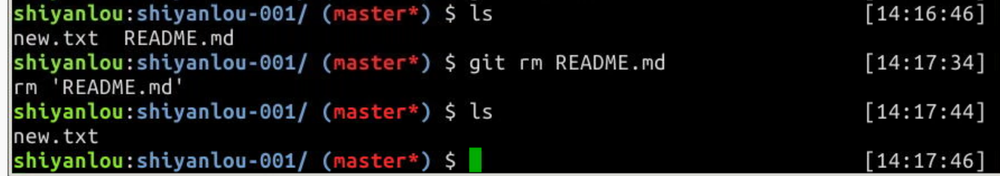

#### 3.2.3 撤销
要把仓库里的改动撤销回克隆下来的状态（注意，如果改动之后执行了提交就无法再撤销，只能从远程仓库重新克隆一份到本地），可以使用 `git reset` 命令，具体步骤如下

比如我们要把刚才删除的 `README.md` 文件给还原回来，就可以在仓库目录下，敲入 `git reset --hard HEAD` 来回退
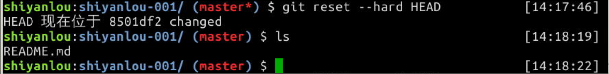

`cat` 一下，可以发现文件已经恢复了
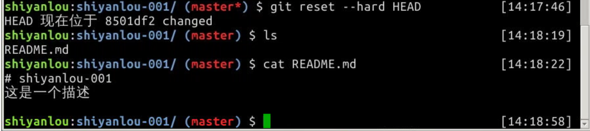

### 3.3 提交仓库的改动
在仓库的每一次改动操作之后，推送同步到远程仓库之前，都需要对这一次或这一批次的操作做提交，命令为 `git commit`，用法是 `git commit -m "你的提交备注"`，只有做好提交动作，才可以开始推送改动到远程仓库同步

因为我之前已经撤销了仓库的改动，这里就重新创建一个新的文件，内容就写“测试”两个字，然后提交改动
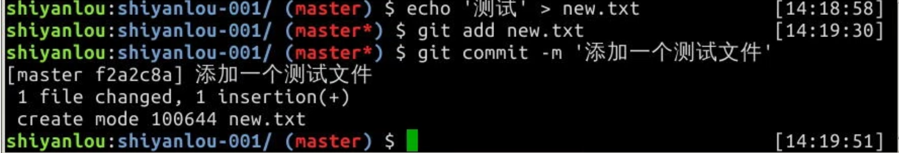

### 3.4 推送改动到远程仓库中
当我们提交了仓库的改动后，就可以开始推送改动的内容到远程仓库了，可以使用 `git push` 命令来推送，用法是 `git push [-u] origin <分支名>`，分支名默认是 master 具体步骤如下

第一次推送改动可以使用 `-u` 参数，使用之后会绑定你这一次的仓库分支名，这样的话下一次推送就不需要加上分支名了，如图，使用之后回提示已经绑定好分支，而且因为我们是 `HTTPS` 协议方式来克隆的仓库，所以每一次同步操作都需要输入用户名和密码
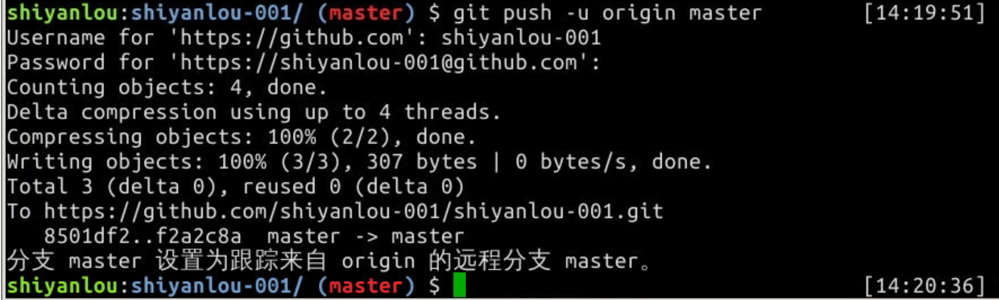

然后我们到远程仓库去看一下，可以发现这个文件已经推送上来了，并且对应的行会显示之前提交操作的备注
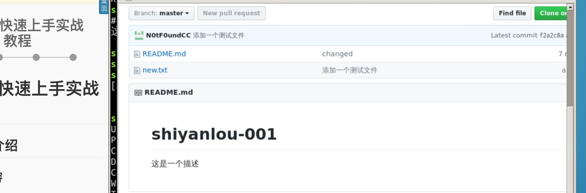

### 3.5 在新的实验环境中同步之前的实验文件
之前的步骤我们已经同步好远程仓库了，现在我们把实验室不保存并关闭，然后重新打开实验，理所当然的之前的实验文件都已经不存在了

然后我们依旧去自己的远程仓库地址，把仓库克隆到本地，可以看到之前实验的文件都在
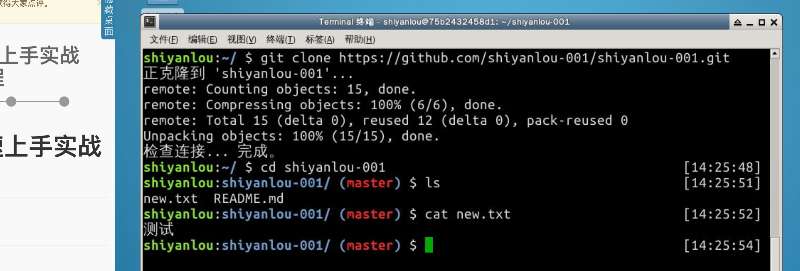

### 3.6 在个人计算机中同步实验室中的进度
为了方便我们离开实验室之后在个人机器上做实验，我们可以在最开始的个人机器的本地仓库中同步远程仓库的更新下来

#### 3.6.1 查看仓库改动
首先我们可以通过 `git fetch` 命令查看有哪一些新改动，用法是在仓库目录下敲入 `git fetch origin`
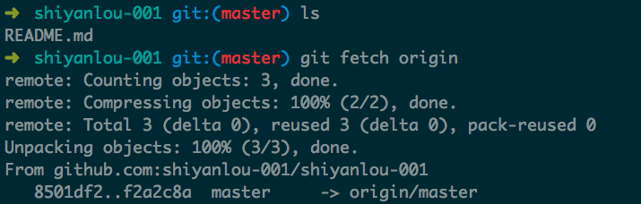

#### 3.6.2 下拉仓库同步
确认好更新的内容后，下一步就是把更新给同步到本地仓库中了，通过 `git pull` 命令来实现，具体用法是 `git pull origin <分支名>`，分支名默认是 master，再查看一下目录，可以看到已经同步好了
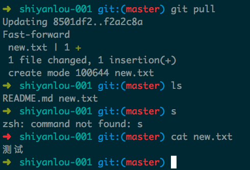

## 四、总结
通过 `Github` 这样的管理方式，我们就可以保存每一次实验的文件，以此来维持实验进度，下一次打开实验室，只需要把自己对应的远程仓库克隆到本地，就可以做到接着上一次实验进度展开学习了。
