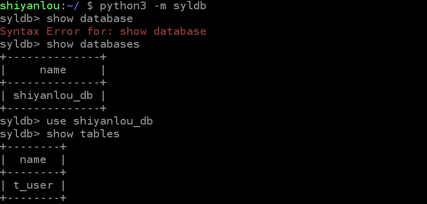
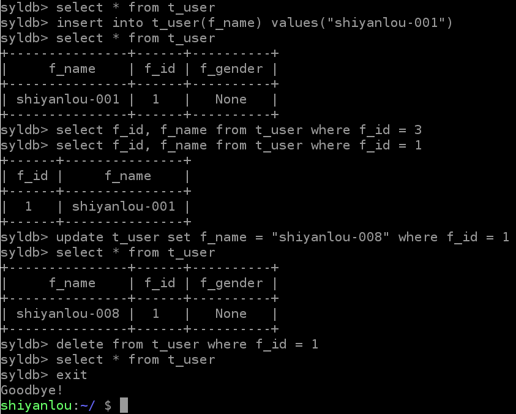

# 看我如何使用 Python 实现一个轻量型数据库

## 课程介绍
本训练营为使用 `Python` 实战开发一个轻量型数据库，从数据库需求分析，架构设计，到模块化各个功能，依次实现最终组合成一个数据库。功能模块包括数据库调度核心 `引擎模块`，`数据库模块`，`数据表模块`，`数据表字段模块`，`数据键值约束功能`，`执行条件模块`，`异常处理模块`，`SQL 语法解析模块`，并且实现了类似 `MySQL` 的 `命令行交互`，可脱离代码直接使用 `SQL 结构化查询语句` 进行使用。

## 课程特点
本次教程所有核心功能全部为纯 `Python` 实现，没有依赖任何第三发库进行实现，可增强学员对 `Python` 的理解，锻炼自己在不需要第三方依赖的情况下进行编程的能力，以及如何自行设计与实现特定的数据结构。而且数据库的保存加载分别使用了 `序列化` 与 `反序列化`，学员也可以从中学到在 `Python` 中如何编写一个可以进行迁移或传输的 `类` 对象。

## 演示效果

## 整个训练营环境
* `Python3`
* `Xfce` 终端

## 适合人群
熟悉 `Python` 语法、对数据库有一定经验的同学

## 课程目标
从实战中学会如何开发一个数据库，从中加深对 `Python` 和 `数据库` 的理解

## 实验列表
* 数据库需求分析
* 数据库架构设计
* 实现数据字段模块
* 实现数据表模块
* 实现数据库模块
* 实现数据库引擎
* 实现条件判断模块
* 实现SQL 语法解析模块与命令行交互
* 实现异常处理
* 总结
