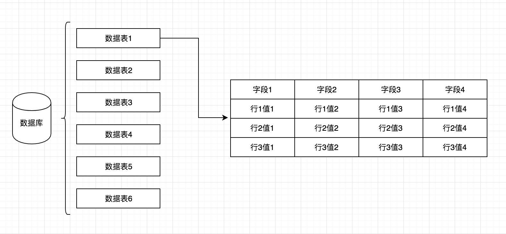
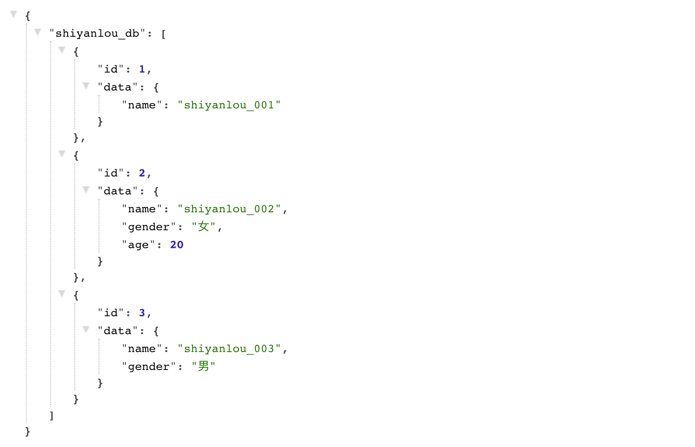
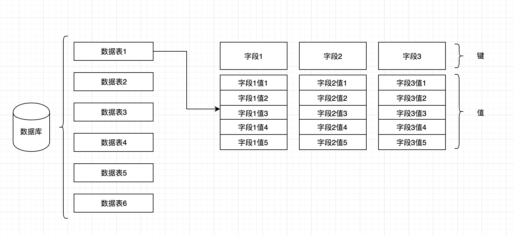

## 需求分析

## 一、实验说明
### 1.1 内容
本节是纯理论知识课程，主要分析我们整个项目的前期需求，整理需要实现的模块，为下一步的数据库架构做好准备。

### 1.2 涉及知识点
* `MySQL`
* `NoSQL`

## 二、站在巨人的肩膀上 -- 从主流数据库中寻找灵感
### 2.1 关系型数据库特性
这里我们关系型数据库的例子为 `MySQL` 数据库，它是一款非常主流的关系型数据库软件，免费且开源，它的内部存储结构是通过数据库，数据表来确定数据集合，通过数据字段名来定义每一行数据中各个值的意义，其本质可以理解为一张二维表，定位数据是按数据字段中的值作为判断依据来实现的，大致结构如下图

并且数据表中每一个字段都可以预先定义号数据类型和约束，防止后期操作时出现不必要的错误数据，常见的约束和数据类型如下

* 数据类型
    * TINGINT -- 8位整型
    * INT -- 32位整型
    * VARCHAR -- 字符型
    * DATETIME -- 时间日期
    * TIMESTAMP -- 时间戳
    * FLOAT -- 单精度浮点型
    * DOUBLE -- 双精度浮点型
* 数据约束
    * 主键约束 -- 约束字段不能重复和不能为空
    * 外键约束 -- 连接其它数据表相同数据类型的某一个字段
    * 唯一约束 -- 值不能重复
    * 非空约束 -- 值不能为空
    * 默认约束 -- 当插入一行新的数据是时字段没被指定初始值，则赋值为预先指定的默认值
    * 自增约束 -- 只能跟在有主键约束并且为整型类型的字段后面

在这里要额外补充的是外键约束，作为关系型数据库，在描述不同关系模型对象之间的联系时，外键是一个非常方便的存在，但也有一些其它的替代方案，比如映射，常用的做法是在建立一张映射表，里面每行数据分别记录两张表中可以作为数据标识的字段的值，通常为主键字段的值，然后用同一行数据中的两个主键值作为关联依据从 A 表中找到 B 表关联的数据。在后面实现中由于外键约束的实现成本比较大，所以会用这种方案来替代。

### 2.2 非关系型数据库特性
非关系型数据库就是 `NoSQL`，它的主流种类很多，比如 `ElasticSearch` ，这里就不针对性介绍了，只说一下它的数据结构。

`NoSQL` 的数据库强大之处就在于它的灵活性，因为其无结构化的键值对数据结构（比如 `JSON` 格式的数据），相比关系型数据库那种在行列二维表中以某一行数据的某一列字段的值来定位的方式，它则是通过键值来定义数据集合，只能通过键来作为数据操作时的的判断依据，所以它的查询速度会更加快，大致结构如下图，从图中也能看出它的无结构特性

## 三、确定数据结构
关系型数据库的数据结构优势在于结构化，操作灵活方便，非关系型数据库则是无结构化，操作没有关系型数据库那么灵活，但是速度高，所以我们这里取两者折中的一种方案来作为我们数据库的核心数据结构，也就是在一个结构化的集合中，用类键值对的方式来存放数据，在 `不同键中，相同索引的值视为一组数据集`，类似二维表中行的概念，后续会根据实现的过程中来理解这个结构，现在就先来看看这个结构的模型图

## 四、确定需求
从第三点我们可以明确我们的数据库核心 -- 数据结构，那么应该如何实现它呢？可以把图中各个部分拆解成每一个单一的小模块，比如定义数据库的 `数据库模块`，定义数据表的 `数据表模块`，确定数据集合的 `数据字段模块`，数据结构由这三个模块组成，接下来就需要有一个操作这个结构的模块，也就是 `数据库引擎模块`，然后数据库操作中，往往需要根据各种情景条件作为判断，那就是 `条件模块`，之后则是考虑到为了实现 `SQL 结构化查询语句解析` 和命令行交互，所以需要一个 `SQL 语句解析模块` 和 `命令行交互模块`，最后无可厚非的就是 `异常处理模块` 了，这也是我本人在写程序时的习惯之一，那么总结之后，我们要实现的模块如下
* 库模块
* 表模块
* 字段模块
* 引擎模块
* 条件模块
* 解析模块
* 交互模块
* 异常处理模块

## 五、总结
本节我们了解了关系型数据库和非关系型数据库的特性，确定了我们的核心也就是数据库的数据结构，并且通过这个数据结构延伸分析了我们的需求，下一节我们就来确定架构。
