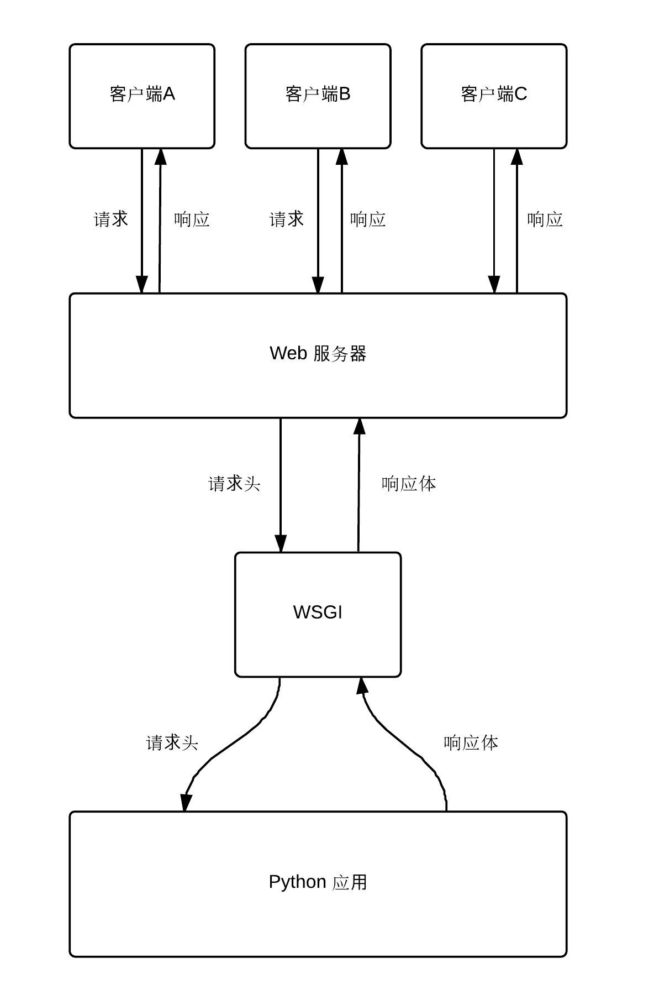

## WSGI 简介

## 一、实验说明
### 1.1 实验内容
本节主要介绍 `WSGI` 的概念，理清它在服务器与 `Web 框架` 中充当的角色。

### 1.2 要求知识点
* `HTTP 协议`
* `Web 服务器`
* `Web 框架`

## 二、什么是 WSGI
### 2.1 概念
对于 `WSGI` （Web Server Gate Interface）`Web 服务器网关接口` ，从英文字可以得知它是一个接口，说得更通熟易懂的话就是规范，它规定了 `Web 服务器` 到 `Web 框架` 之间通信的规则，也就是一个桥梁。

### 2.2 交互流程
图 2.2

如图 2.2所示，正常情况下我们直接感受到的就是客户端发起请求到 `HTTP 服务器` 获取对应的响应结果，而图中则多了 `Python 应用` （这里可以理解为用 Python 的 Web 框架编写的应用程序）这一层对请求处理与响应返回，然后服务器再把它返回给用户，而 `Web 服务器` 是没办法直接解释 `Python` 脚本的，于是就有了 `WSGI` 这一层，它负责把请求封装成 `Python` 可以解释的一个数据结构，然后调度 `Python 应用` 进行处理，再让 `Python 应用` 根据一定的格式规则封装成一个响应体， `WSGI` 模块解释过后再把它返回给服务器，最后服务器再返回给客户端，这就是 `WSGI` 模块的作用，所以对于一个 `Web 框架`，它首先要实现的就是供 `WSGI` 模块调度的入口。

## 三、总结
这一节我们梳理了 `WSGI` 的概念和清楚了`Web 服务器`、`WSGI` 和 `Web 框架` 之间的关系与交互方式。
