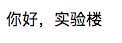

## 实现 MVC 设计模式
## 一、实验说明
### 1.1 实验内容
本节内容将继上一节提到 `MVC` 设计模式在 `Web 框架` 中 进行实现，也就是逻辑、数据与展示页面的代码层分离。

### 1.2 涉及知识点
* `MVC` 设计模式
* 视图
* 控制器

### 1.3 实验环境
* `Sublimt` 编辑器
* `Python3`
* `Xfce` 终端

### 1.4 实验步骤
* 设计并实现负责逻辑处理的视图
* 设计并实现负责规则绑定的控制器
* 实战基于 MVC 设计模型的开发范式

## 二、MVC 设计模式的实现
### 2.1 视图 -- 逻辑处理
首先回到路由追踪那一节，我们可以看到 `URL` 规则绑定是通过 `add_url_rule` 方法来绑定的，所以我们可以把它作为接口，视图通过实现 `add_url_rule` 这个接口来吧规则绑定到框架中
```python
...

# 我这里以实验楼名字缩写命名框架名字： “实验楼 Framework”
class SYLFk:
    ...

    # 添加路由规则
    def add_url_rule(self, url, func, func_type, endpoint=None, **options):

        # 如果节点未命名，使用处理函数的名字
        if endpoint is None:
            endpoint = func.__name__

        # 抛出 URL 已存在异常
        if url in self.url_map:
            raise URLExistError

        # 如果类型不是静态资源，并且节点已存在，则抛出节点已存在异常
        if endpoint in self.function_map and func_type != 'static':
            raise EndpointExistError

        # 添加 URL 与节点映射
        self.url_map[url] = endpoint

        # 添加节点与请求处理函数映射
        self.function_map[endpoint] = ExecFunc(func, func_type, **options)
    ...
```

所以我们的视图也需要发送三个参数也就是 `url`, `func` 和 `func_type` 到 `add_url_rule` 方法中来绑定规则，而从 `dispatch_request` 路由追踪方法可以看到我们已经预先定义好视图处理函数的类型为 `view`，而且我们知道要实现继承关系，所以视图应该是个对象，那么我们可以在 `add_url_rule` 之上先封装好一个视图的规则绑定，代码如下
```python
...

# 我这里以实验楼名字缩写命名框架名字： “实验楼 Framework”
class SYLFk:
    ...

    # 添加视图规则
    def bind_view(self, url, view_class, endpoint):
        self.add_url_rule(url, func=view_class.get_func(endpoint), func_type='view')
```

然后通过函数内部逻辑又可以知道，我们设计的对象中需要实现一个 `get_view` 方法，它是个类方法不是实例方法，这里要注意，并且会把节点名作为参数传进去作为函数名，而且可以看到这里我们调用 `add_url_rule` 方法时是没有为 `endpoint` 参数赋值的，也就是它用的默认的 `None` 这个空值，而通过 `add_url_rule` 方法中的内部逻辑我们可以知道，当 `endpoint` 参数为空，节点名就是函数名，所以 `add_view` 方法的 `endpoint` 参数即是视图对象中处理函数的名字，又要作为规则绑定的节点名，那么就需一个灵活的函数设计，也就是视图对象的 `get_view` 返回的应该是一个动态生成的函数。现在需求明确了，接下来就通过代码来理解它的实现吧，代码定定义在 `view` 包中
```python
# 视图基类
class View:
    # 支持的请求方法
    methods = None

    # 请求处理函数映射
    methods_meta = None

    # 视图处理函数调度入口
    def dispatch_request(self, request, *args, **option):
        raise NotImplementedError

    # 生成视图处理函数，参数 name 其实就是节点名
    @classmethod
    def get_func(cls, name):

        # 定义处理函数
        def func(*args, **kwargs):
            # 在处理函数内部实例化视图对象
            obj = func.view_class()

            # 通过视图对象调用处理函数调度入口，返回视图处理结果
            return obj.dispatch_request(*args, **kwargs)

        # 为处理函数绑定属性
        func.view_class = cls
        func.__name__ = name
        func.__doc__ = cls.__doc__
        func.__module__ = cls.__module__
        func.methods = cls.methods

        # 返回这个处理函数
        return func
```

仔细阅读代码，其实核心的逻辑处理是放在视图对象的 `dispatch_request` 中的，而之前说过视图要做的是可以继承，所以它是个类，并且 `dispatch_request` 会抛出未实现的异常，接下来看类方法 `get_func`，它的内部定一个了一个函数，并且在函数内部通关它自己的 `view_class` 属性实例化了一个视图对象，然后在调用对象的处理函数获取结果，所以才会有
```python
func.view_class = cls
```
这行代码，把对象绑定为该函数的成员之一，做到可以在内部实例化，并且把外部的 `name` 参数作为自身的 `__name__` 属性值，实现函数名与节点名的绑定，绑定完属性后，在把它作为结果返回，这样在 `add_view` 方法中的 `add_url_rule` 里 `func` 参数的值实际上就是这个类方法生成的函数，其实也就是闭包的一种实现，通过它生成的每个函数都是独立的。

### 2.2 控制器 -- 规则绑定
上一小节我们已经实现了负责逻辑处理的视图基类，并且也写好了 `add_view` 这个为视图绑定规则的方法，那么控制器这一小节要负责的就是完成 `URL` 与视图对象的关联，也就是如何去使用 `add_view`，这里要分两步，首先来看看下面这分代码：

首先是定义在 `view` 包里的 `Controller` 类
```python
...

# 控制器类
class Controller:
    def __init__(self, name, url_map):
        self.url_map = url_map  # 存放映射关系，一个元素为 Dict 的 List
        self.name = name  # 控制器名字，生成节点时是会用到，为了区分不同控制器下同名的视图对象

    def __name__(self):
        # 返回控制器名字
        return self.name
```

接着是定义在框架主体内的 `load_controller` 方法
```python
...

    # 控制器加载
    def load_controller(self, controller):

        # 获取控制器名字
        name = controller.__name__()

        # 遍历控制器的 `url_map` 成员
        for rule in controller.url_map:
            # 绑定 URL 与 视图对象，最后的节点名格式为 `控制器名` + "." + 定义的节点名
            self.bind_view(rule['url'], rule['view'], name + '.' + rule['endpoint'])
    ...
```

通过这两个方法我们分析以下绑定的流程，首先是实例化一个控制器，这个控制器需要两个参数，一个是作为生成节点名时会使用的 `name`，另一个是 `url_map`，而通过框架主体文件中的 `load_controller` 可以知道 `url_map` 的内部构造，就是一个 `List` 对象，里面的每一个元素都是拥有 `url`、`view` 和 `endpoint` 这三个键的字典，`load_controller` 会遍历一遍这个 `url_map`，再把每一个 `Dict` 通过 `bind_view` 绑定添加到 `url_map` 中。

最后我们回到路由那一节中还未实现的位于框架主体中的 `dispatch_request` 方法里的视图处理逻辑，添加以下代码实现处理
```python
    ...

    # 路由追踪，应用请求处理函数调度入口
    def dispatch_request(self, request):
        ...
        elif exec_function.func_type == 'view':
            """ 视图处理逻辑 """

            rep = view_function.func(request)
        ...
```

至此，框架的 MVC 开发模式大致完成，在下一节中我们再实现一个简易的模版引擎，把页面展示的内容也分离出去，就算完成了，但同学们也许会开始感到疑惑这样设计之后，实际开发要怎么去使用，所以下面我们就先来学习下怎么基于控制器去开发。

## 三、MVC 模式开发实战
首先我们先在 `main.py` 文件同级目录下创建一个 `core` 的文件夹，并在里面生成一个名为 `base_view.py` 的文件，然后敲入下面的代码再来分析
```python
from sylfk.view import View


class BaseView(View):
    # 定义支持的请求方法，默认支持 GET 和 POST 方法
    methods = ['GET, POST']

    # POST 请求处理函数
    def post(self, request, *args, **options):
        pass

    # GET 请求处理函数
    def get(self, request, *args, **options):
        pass

    # 视图处理函数调度入口
    def dispatch_request(self, request, *args, **options):
        # 定义请求方法与处理函数的映射
        methods_meta = {
            'GET': self.get,
            'POST': self.post,
        }

        # 判断该视图是支持所请求的方法，如果支持则返回对应处理函数的结果，反之返回错误提示
        if request.method in methods_meta:
            return methods_meta[request.method](request, *args, **options)
        else:
            return '<h1>Unknown or unsupported require method</h1>'
```
这个 `BaseView` 是继承了上面那个 `View` 基类并实现了 `dispatch_request` 类，内部对 `Get` 与 `Post` 两种请求方法都做好了路由，作为应用开发时的底层库，通过这个 `BaseView`，我们之后每次开发只需要继承它，并再实现对应的 `get` 或者 `post` 方法就可以了，大大的减少了我们的代码量，并且使逻辑更加清晰。

然后回到 `main.py` 文件，先去掉两个 `route` 装饰的代码块，修改为以下代码
```python
from sylfk import SYLFk
from sylfk.view import Controller

from core.base_view import BaseView


class Index(BaseView):
    def get(self, request):
        return '<h1>你好，实验楼</h1>'


class Test(Index):
    def post(self, request):
        return "<h1>这是一个POST请求</h1>"


app = SYLFk()

syl_url_map = [
    {
        'url': '/shiyanlou',
        'view': Index,
        'endpoint': 'index'
    },
    {
        'url': '/test',
        'view': Test,
        'endpoint': 'test'
    }
]

index_controller = Controller('index', syl_url_map)
app.load_controller(index_controller)


app.run()
```
最后的目录结构是这样的
```bash
.
├── core
│   └── base_view.py
├── main.py
├── static
│    ├── index.css
│    └── index.js
└── sylfk
     ├── __init__.py
     ├── dbconnector
     │      └── __init__.py
     ├── exceptions
     │      └── __init__.py
     ├── helper
     │      └── __init__.py
     ├── route
     │      └── __init__.py
     ├── session
     │      └── __init__.py
     ├── template_engine
     │      └── __init__.py
     ├── view
     │      └── __init__.py
     └── wsgi_adapter
            └── __init__.py

```
运行
```bash
python3 main.py
```

这样看是不是代码更加清晰可读了，并且实现也非常简单，而且逻辑之间可以直接有继承关系，在访问“/shiyanlou”和“/test”这两个 `URL` 时，将有相同的页面返回结果，因为 `Test` 类继承了 `Index` 类的 `get` 方法，所以当发起的请求都是 `GET` 的话，结果都会是“你好，实验楼”。



而且 `Test` 类自身如果要多实现一个 `POST` 请求的处理方法也很简单，直接在 `post` 方法中重载就行了，然后定义 `syl_url_map` 做好 `URL` 与 `视图` 的映射并把它初始化在控制器中，最后用框架的 `load_controller` 加载以下控制器，就完了。而且当想要把“/shiyanlou”中的逻辑换掉时，只需要把对应字典的 `view` 键中的值替换就行了，比如把 `Test` 和 `Index` 两个类在字典中的位置互相替换，就可以实现相反的结果了，所以综上所诉实现一个 `MVC 设计模式` 的开发范式的便捷是不是就体现出来了，不过这里我们可以看到页面的结果还是在 `视图` 对象中，下一节我们就来实现一个简单的模版引擎，把页面相关的内容给分离出去，实现完整的 `MVC 模式`。

## 四、总结
本节我们设计了 `Web 框架` 的 `MVC 设计模式`，并分离出了 `URL` 和处理函数，完成了 `视图` 和 `控制器` 的开发，最后还学会了如何基于 `MVC 设计模式` 去开发一个 `Web 应用程序`，剩下的界面分离部分我们将在后续章节中进行学习。
