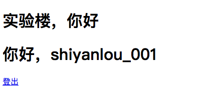

## 实现 HTTP 会话维持

## 一、实验说明
### 1.1 实验内容
本节主要讲如何对无状态的 `HTTP 协议` 实现用户身份识别，做到从无状态到有状态实现交互会话维持。

### 1.2 涉及知识点
* `HTTP 协议`
* `Cookie`
* `Session`
* `time` 模块
* `json` 模块
* `base64` 模块

### 1.3 实验环境
* `Sublimt` 编辑器
* `Python3`
* `Xfce` 终端

### 1.4 实验步骤
* 介绍 `Cookie` 与 `Session` 的区别
* 为框架实现了 `Session` 模块
* 定义了视图的会话验证装饰器接口
* 实战如何使用会话模块和验证装饰器来做交互

引出 Cookie，Cookie的读取与设置，设计一个Cookie存储方式，每一次请求都判断一下Cookie，根据判断结果进行不同的操作，实现会话维持。
客户端请求发起者识别 -> 识别需要做到唯 -> 设计 session 存储方式 -> session 设置方式 -> 从请求中读取 session id -> 从本地找出对应 session
客户端唯一版定

## 二、Cookie 与 Session 的关系
### 2.1 什么是 Cookie
`Cookie` 的翻译其实并不重要，这里我们需要的是理解为什么有 `Cookie`，它又在基于 `HTTP 协议` 的通信中起了什么作用。

首先明确一下 `HTTP 协议` 的无状态的本质，最开始客户端发起的每一个请求交互都是差不多一样的，而客户端有无数个，服务端只有一个，没有更多的状态或者说属性可以让服务器判断出这个请求的具体发起者是哪一个用户。比如有一个客户端点了一个购买商品的链接，但是服务器根本不知道到底是哪一个用户购买，也就没有相应的做扣费操作，这时候就需要有一个状态或者说属性，可以让服务器判断这个请求的发起者的具体身份，也就是需要一个标识用户身份的数据集合，所以 `Cookie` 就诞生了。客户端在每一次发起请求时，把自己的身份信息存放在 `Cookie` 中并附加在请求报头里一起发送，服务端收到请求之后再从 `Cookie` 中把这些信息读出来以此判断具体是哪一个用户，实现通信双方的交互。

接下来说说 `Cookie` 的弊端，从上面的信息可以看出，用户信息是附加在请求中发起的，也就是说这些信息是保存在客户端的，这些信息有可能是保存在用户设备的内存中，也有可能保存在硬盘中，有时候服务端需要的信息会比较负责庞大，而 `Cookie` 本身的存储量是限制在 4KB 左右，那么太大太复杂的信息就无法发送，并且又因为每一次都需要附带在请求发起，过大过复杂的请求报文变相的也增加了流量，再者就是通常为了方便操作，`Cookie` 中存放的数据是一个键值对，假设有一个服务端的判断用户身份是通过 `Cookie` 中的 `User` 这个键的值来识别用户是谁，这个值的设置通常情况下是在登录验证通过之后，返回给客户端让客户端保存，之后发起请求附带进去就行，但是这里面其实会有一些安全隐患存在的，比如有恶意用户通过修改这个 `User` 键的值，让服务端误以为是另一个用户，返回了这个用户的信息造成泄漏，甚至是在商品购买时错误扣费造成经济损失等安全事故，所以后来又出现了一种把信息保存在服务端的技术，也就是 `Session`。

### 2.2 什么是 Session
`Session` 的存在与 `Cookie` 一样，就是维持会话，并且 `Cookie` 也是 `Session` 中的一部分，上面我们说过 `Cookie` 是把用户信息保存在客户端，导致恶意用户可以任意修改来实现越权，所以就在 `Cookie` 的基础上衍生除了 `Session`，与 `Cookie` 的本质区别就是信息保存放由客户端变成服务端，这样不仅减少了流量，还大大的提高了越权的门槛。

现在我们知道了 `Session` 的存储方法，那么它到底是怎么工作的呢？其实也是一个很简单的思路，它依旧会让客户端设置 `Cookie`，但不同于存储用户信息等数据，它现在只会存放一个 `标识`，通常是一个 `Session ID`，一串无意义的字符串，客户端第一次与服务端连接时，会收到一个设置这个 `标识` 的相应报头，之后每一次发起请求附带这个 `标识` 就可以让服务端进行身份判断了。

说完客户端的流程，我们再来看看服务端是如何工作的。首先是在本地建立一个映射关系，里面关联用户数据与这个唯一的 `标识`。这个映射最开始是空的，当服务端收到一个没有附带 `Session ID` 或者这个 `Session ID` 不存在于服务端的映射关系中的请求时，会生成一个唯一 `标识`，添加到这个映射关系中，当然因为是第一次访问，所以这个刚生成的 `标识` 关联的数据是空的，然后把这个 `标识` 返回给客户端设置到 `Cookie` 中，用户下次发起请求时，这个 `标识` 也附带在报文中，服务端收到请求后，验证用户是否合法，如果不合法，通常会返回验证页面给用户进行权限验证，反之则返回真正请求的数据，这就是 `Session` 的工作流程，下一步我们就为这个 `Web 框架` 实习基于 `Session` 这个概念的会话维持。

## 三、Web 框架中的 Cookie 操作
### 3.1 从请求中读取 Cookie
从上面的内置知道我们要实现 `Session` 也需要操作 `Cookie`，也知道了 `Cookie` 是存放在请求报头中的，而我们的 `Web 框架` 的请求报头是由 `WSGI` 返回给过来的，那么就首先来明确下在这个 `Web 框架` 中如何从 `WSGI` 返回的请求中读取 `Cookie`，重新回头来看 `WSGI` 入口函数
```python
# WSGI 调度框架入口
def wsgi_app(app, environ, start_response):
    # 解析请求头
    request = Request(environ)

    # 把请求传给框架的路由进行处理，并获取处理结果
    response = app.dispatch_request(request)

    # 返回给服务器
    return response(environ, start_response)
```
从代码逻辑里可以看出 `WSGI` 把请求传给了框架的 `dispatch_request` 方法，那么其实很明显了，`Cookie` 在框架内部是由 `dispatch_request` 方法的 `request` 参数中读取的，代码如下
```python
...

# 我这里以实验楼名字缩写命名框架名字： “实验楼 Framework”
class SYLFk:
    ...

    # 应用请求处理函数调度入口
    def dispatch_request(self, request):
        ...

        # 从请求中取出 Cookie
        cookies = request.cookies
    ...
```
这就是获取 `Cookie` 的方法，返回的值是一个字典。

### 3.2 于响应体中设置 Cookie
而通知客户端设置 `Cookie`，也是很简单的，只需要在响应报头里添加 `Set-Cookie` 这个属性就可以让客户端保存 `Cookie` 了，保存的内容就是 `Set-Cookie` 的值，而我们之前的响应报头是定义在 `dispatch_request` 方法中，所以可以这么修改来实现如果客户端没有 `Session ID` 则手动分配一个给它，反之则不需要分配，代码如下
```python
from isafk.session import create_session_id
...

# 我这里以实验楼名字缩写命名框架名字： “实验楼 Framework”
class SYLFk:
    ...

    # 应用请求处理函数调度入口
    def dispatch_request(self, request):
        ...

        # 从请求中取出 Cookie
        cookies = request.cookies

        # 如果 session_id 这个键不在 cookies 中，则通知客户端设置 Cookie
        if 'session_id' not in cookies:
            headers = {
                'Set-Cookie': 'session_id=%s' % create_session_id(), # 定义 Set-Cookie属性，通知客户端记录 Cookie，create_session_id 是生成一个无规律唯一字符串的方法
                'Server': 'Shiyanlou Framework'   # 定义响应报头的 Server 属性
            }
        else:
            # 定义响应报头的 Server 属性
            headers = {
                'Server': 'Shiyanlou Framework'
            }
    ...
```
代码里面的 `create_session_id` 方法是用来生成唯一标识的，在下一小节中的实现会话维持中会详细讲解，而 `Set-Cookie` 就是在 `Web 框架` 中实现通知客户端记录 `Cookie` 的方法，记录通常由浏览器自行保存。

## 四、会话维持的实现
### 4.1 为客户端生成会话的唯一标识
上一小节我们用到了 `create_session_id` 这个方法，现在我们就来看看他的内部实现，代码定义在 `session` 包中
```python
import base64
import time


# 创建 Session ID
def create_session_id():
    # 首先获取当前时间戳，转换为字符串，编码为字节流，在 Base64 编码，在解码为字符串，然后去掉 Base64 编码会出现的“=”号，取到倒数第二位，最后再进行倒序排列
    return base64.encodebytes(str(time.time()).encode()).decode().replace("=", '')[:-2][::-1]
```
生成的逻辑都写在注释里了，这里就不再赘述了，下面就接着研究下如何记录这些 `Session ID` 和与其所关联的数据吧。

### 4.2 记录对应客户端的 Session 值
依旧是老方法需求分析，首先先明确 `Session` 数据的组成，它由两个字典嵌套组成，第一个字典是存放 `Session ID` 与数据块的映射，第二个字典其实就是数据块，里面也是存放键值对，这样方便我们对 `Session` 的管理操作，那么既然是一个映射表，就需要由一个表作为成员变量，一个添加关联的方法，一个对关联的数据进行添加的方法，又因为在实际交互中存在比如登出这种需要从 Cookie 中抹除数据的操作，所以还需要一个删除对 `Session ID` 关联的数据提供一个删除方法，所以 `Session` 这个类目前的结构如下，定义在 `session` 包中
```python
...

# 从请求中获取 Session ID
def get_session_id(request):
    return request.cookies.get('session_id', '')

# 会话
class Session:

    # Session 实例对象
    __instance = None

    # 初始化方法
    def __init__(self):

        # 会话映射表
        self.__session_map__ = {}

    # 单例模式，实现全局公用一个 Session 实例对象
    def __new__(cls, *args, **kwargs):
        if cls.__instance is None:
            cls.__instance = super(Session, cls).__new__(cls, *args, **kwargs)
        return cls.__instance

    # 更新或添加记录
    def push(self, request, item, value):

        # 从请求中获取客户端的 Session ID
        session_id = get_session_id(request)

        # 如果这个 Session ID 已存在与映射表中，则直接为其添加新的数据键值对，如果不存在，则先初始化为空的字典，再添加数据键值对
        if session in self.__session_map__:
            # 直接对当前会话添加数据
            self.__session_map__[get_session_id(request)][item] = value
        else:
            # 初始化当前会话
            self.__session_map__[session_id] = {}
            # 对当前会话添加数据
            self.__session_map__[session_id][item] = value

    # 删除当前会话的某个项
    def pop(self, request, item, value=True):

        # 获取当前会话
        current_session = self.__session_map__.get(get_session_id(request), {}):

        # 判断数据项的键是否存在于当前的会话中，如果存在则删除
        if item in current_session:
            current_session.pop(item, value)

# 单例全局对象
session = Session()
```
这里重载了 `__new__` 方法，因为要实现全局共用一个 `session` 实例，所以实现了单例模式，之后就是添加当前会话数据的 `push` 方法和删除当前会话数据的 `pop` 方法，由于注释写的很详细，这里就不再赘述了。

### 4.3 Session 的本地缓存
上一小节初步实现了 `Session` 的基础操作，但是并没有在本地做缓存，也就是说如果应用关闭了再重新打开，之前的所有会话将会全部清空，用户需要重新进行会话验证来回到之前的访问状态，使得用户体验是非常不好的，特别是对于运行在境外需要频繁迁移的服务，每一次迁移或者修改而做的重启操作就会为用户带来不必要的麻烦，为了防止这种情况，我们要把 `Session` 记录缓存到本地保存起来。

对于本地保存，我们需要找一个合理的存储方式，并且合理的时机，不然每一次请求不管三七二十一都在本地保存以下，会大大提高本地的 "I/O" 读写，当用户量上升到一定程度时，会给服务器带来巨大的压力，所以这里我们设计为当某个会话的记录发生变化时保存一次。注意这里精确到了某一个，如同学们想的一样，在本地我们会单独把每一个 `Session` 会话从 `__session_map__` 中取出来一一分开保存，而记录发生变化也就是是当进行 `push` 或者 `pop` 操作的时候，所以这两个方法里面都需要触发存储，那么下面来看看代码实现
```python
import os
import json
...

# 会话
class Session:
    ...

    # 初始化方法
    def __init__(self):
        # 会话映射表
        self.__session_map__ = {}

        # 会话本地存放目录
        self.__storage_path__ = None

    # 设置会话保存目录
    def set_storage_path(self, path):
        self.__storage_path__ = path

    # 保存会话记录到本地
    def storage(self, session_id):
        # 构造 Session 会话的本地文件路径，文件名为 Session ID
        session_path = os.path.join(self.__storage_path__, session_id)

        # 如果已设置 Session 会话存放路径，则开始缓存到本地
        if self.__storage_path__ is not None:
            with open(session_path, 'wb') as f:
                # 将会话记录序列化为字符串
                content = json.dumps(self.__session_map__[session_id])

                # 进行 base64 编码再写入文件中，防止一些特定二进制数据无法正确写入
                f.write(base64.encodebytes(content.encode()))

    # 更新或添加记录
    def push(self, request, item, value):

        # 从请求中获取客户端的 Session ID
        session_id = get_session_id(request)

        # 如果这个 Session ID 已存在与映射表中，则直接为其添加新的数据键值对，如果不存在，则先初始化为空的字典，再添加数据键值对
        if session_id in self.__session_map__:
            # 直接对当前会话添加数据
            self.__session_map__[get_session_id(request)][item] = value
        else:
            # 初始化当前会话
            self.__session_map__[session_id] = {}

            # 对当前会话添加数据
            self.__session_map__[session_id][item] = value

        # 会话发生变化，更新缓存到本地
        self.storage(session_id)

    # 删除当前会话的某个项
    def pop(self, request, item, value=True):

        # 获取当前会话
        session_id = get_session_id(request)
        current_session = self.__session_map__.get(session_id, {})

        # 判断数据项的键是否存在于当前的会话中，如果存在则删除
        if item in current_session:
            current_session.pop(item, value)

            # 会话发生变化，更新缓存到本地
            self.storage(session_id)
```
这里主要添加了两个方法，一个是 `set_storage_path`，这个方法定义了 `Session` 会话内容的本地缓存路径，另一个是 `storage` 方法，这个方法负责把 `Session` 会话的内容保存到本地，然后再在 `push` 和 `pop` 这两个会话内容操作方法中触发 `storage` 进行保存，现在已经把会话内容缓存在本地中了，下一步就来实现从本地加载。

### 4.4 Session 的启动加载
上一步我们完成了 `Session` 的本地缓存，接下来就来实现本地加载，代码如下
```python
...

# 会话
class Session:
    ...

    # 加载本地会话记录
    def load_local_session(self):

        # 如果已设置 Session 会话存放路径，则开始从本地加载缓存
        if self.__storage_path__ is not None:

            # 从本地存放目录获取所有 Session 会话记录文件列表，文件名其实就是 Session ID
            session_path_list = os.listdir(self.__storage_path__)

            # 遍历会话记录文件列表
            for session_id in session_path_list:

                # 构造会话记录文件目录
                path = os.path.join(self.__storage_path__, session_id)

                # 读取文件中的内容
                with open(path, 'rb') as f:
                    content = f.read()

                # 把文件内容进行 base64 解码
                content = base64.decodebytes(content)

                # 把 Session ID 于对应的会话内容绑定添加到会话映射表中
                self.__session_map__[session_id] = json.loads(content.decode())
```
这个方法的逻辑也不复杂，遍历会话记录存放目录下的所有文件，每一个文件其实就是一个会话，文件名是 `Session ID`，内容就是会话记录，遍历之后逐一添加到会话映射表中就行了，而这个方法要在哪里调用比较合适呢？其实就是应该在应用启动之前，也就是在框架的 `run` 方法执行完之前调用，代码如下，定义在框架主体文件的 `run` 方法中国年
```python
from sylfk.session import create_session_id, session
...

# 我这里以实验楼名字缩写命名框架名字： “实验楼 Framework”
class SYLFk:
    ...

    def __init__(self, static_folder='static', template_folder='template', session_path=".session"):
        ...
        self.session_path = session_path   # 会话记录默认存放在应用同目录下的 .session 文件夹中

    # 启动入口
    def run(self, **options):
      # 如果有参数进来且值不为空，则赋值
      for key, value in options.items():
          if value is not None:
              self.__setattr__(key, value)

      self.add_static_rule(self.static_folder)

      # 映射静态资源处理函数，所有静态资源处理函数都是静态资源路由
      self.function_map['static'] = ExecFunc(func=self.dispatch_static, func_type='static')

      # 如果会话记录存放目录不存在，则创建它
      if not os.path.exists(self.session_path):
          os.mkdir(self.session_path)

      # 设置会话记录存放目录
      session.set_storage_path(self.session_path)

      # 加载本地缓存的 session 记录
      session.load_local_session()

      # 把框架本身也就是应用本身和其它几个配置参数传给 werkzeug 的 run_simple
      run_simple(hostname=self.host, port=self.port, application=self)
```
在框架主体的初始化方法中绑定了会话记录默认存放的目录，默认是应用同目录下的 `.session` 文件夹，然后在 `run` 方法中，先判断会话记录存放目录是否存在，如果不存在则创建它，然后设置 `session` 对象的会话记录存放目录，最后再调用 `session` 对象的 `load_local_session` 方法进行加载。

至此，整个 `Web 框架` 的会话交互功能完成，下面开始对常用的 `Session` 操作进行封装。

### 4.5 Session 常用功能封装
#### 4.5.1 获取当前会话
有些时候需要对当前整个会话的内容进行操作，而 `__session_map__` 是定义为私有成员的，所以我们要实现一个方法整个当前会话内容的方法，代码如下，定义在 `session` 包中
```python
...

# 会话
class Session:
    ...

    # 获取当前会话记录
    def map(self, request):
        return self.__session_map__.get(get_session_id(request), {})
```

#### 4.5.2 从当前会话中获取某个数据项
方便实际开发中从会话中取出指定键的值，代码如下，定义在 `session` 包中
```python
...

# 会话
class Session:
    ...

    # 获取当前会话的某个项
    def get(self, request, item):
        return self.__session_map__.get(get_session_id(request), {}).get(item, None)
```

#### 4.5.3 校验装饰器
默认校验装饰器的设计我这里主要是为了方便视图的权限验证而做的，同学们在使用的过程中切记不要局限到视图这里，或者你们有更大的脑洞也欢迎在问答区进行交流，代码如下，定义在 `session` 包中
```python
class AuthSession:

    # Session 校验装饰器
    @classmethod
    def auth_session(cls, f, *args, **options):

        def decorator(obj, request):
            return f(obj, request) if cls.auth_logic(request, *args, **options) else cls.auth_fail_callback(request, *args, **options)
        return decorator

    # 验证逻辑的接口，返回一个布尔值
    @staticmethod
    def auth_logic(request, *args, **options):
        raise NotImplementedError

    # 验证失败的回调接口
    @staticmethod
    def auth_fail_callback(request, *args, **options):
        raise NotImplementedError
```
`AuthSession` 其实应该定位为抽象类，里面包含了三个方法，一个装饰器类方法和两个未实现的静态方法，`auth_session` 判断 `auth_logic` 中的验证是否通过，若通过则执行所装饰的函数也就是视图的处理逻辑，反之则执行 `auth_fail_callback`，通常这里面会是一个登录操作，验证是否登录成功，不成功的化在 `auth_fail_callback` 中再次重定向到登录页面中，这里的重定向的实现将在一章节中讲解，此节不做解释。下面就通过实战一个实现会话维持的应用来学会如何使用这个装饰器来提高开发效率吧。

## 五、实战会话维持
### 5.1 需求分析
现在我们的需求是这样的，有一个首页，它的访问被做了限制，需要登录才能访问，所以这一次我们需要实现两个页面，一个首页一个登录页，并且首页有权限判断。

### 5.2 实现会话视图基类
回到之前实战的应用的 `core` 文件夹中，在 `base_view.py` 文件中利用上面的 `AuthSession` 会话校验装饰器和原先实现好的 `BaseView` 视图基类，封装一个需要在当前会话中存在 `User` 值才能访问的会话视图基类，代码如下
```python
from sylfk.session import AuthSession, session
...

# 登录验证类
class AuthLogin(AuthSession):

    # 如果没有验证通过，则返回一个链接点击到登录页面
    @staticmethod
    def auth_fail_callback(request, *args, **options):
        return '<a href="/login">登录</a>'

    # 验证逻辑，如果 user 这个键不在会话当中，则验证失败，反之则成功
    @staticmethod
    def auth_logic(request, *args, **options):
        if 'user' in session.map(request):
            return True
        return False


# 会话视图基类
class SessionView(BaseView):

    # 验证类抓装饰器
    @AuthLogin.auth_session
    def dispatch_request(self, request, *args, **options):
        # 结合装饰器内部的逻辑，调用继承的子类的 dispatch_request 方法
        return super(SessionView, self).dispatch_request(request, *args, **options)
```
这里定义了一个继承并实现了 `AuthSession` 的类 `AuthLogin`，它验证失败之后的回调结果是返回一个链接，这里本来应该是直接重定向到登录页面的，但是这个功能框架目前还没有，下一章节我们将会实现它。

然后就是继承了 `BaseView` 的 `SessionView` 类，这个类的 `dispatch_request` 方法前加了 `AuthLogin.auth_session` 装饰器，也就是说每一次执行到 `dispatch_request` 时，都会先跑到装饰器内部去验证会话，如果通过才会接着执行 `dispatch_request` 返回的内容。

### 5.3 使用会话视图基类实现需要验证的视图
现在我们就开始用这个 `SessionView` 来实现需要权限验证的首页和登出页，用 `BaseView` 来实现不需要验证的登录页，代码如下，定义在 `main.py` 中
```python
from sylfk import SYLFk, simple_template
from sylfk.session import session
from sylfk.view import Controller

from core.base_view import BaseView, SessionView


# 首页视图
class Index(SessionView):
    def get(self, request):
        # 获取当前会话中的 user 的值
        user = session.get(request, 'user')

        # 把 user 的值用模版引擎置换到页面中并返回
        return simple_template("index.html", user=user, message="实验楼，你好")


# 登录视图
class Login(BaseView):
    def get(self, request):
        return simple_template("login.html")

    def post(self, request):
        # 从 POST 请求中获取 user 参数的值
        user = request.form['user']

        # 把 user 存放到当前会话中
        session.push(request, 'user', user)

        # 返回登录成功提示和首页链接
        return '登录成功，<a href="/">返回</a>'


# 登出视图
class Logout(SessionView):
    def get(self, request):
        # 从当前会话中删除 user
        session.pop(request, 'user')

        # 返回登出成功提示和首页链接
        return '登出成功, <a href="/">返回</a>'


syl_url_map = [
    {
        'url': '/',
        'view': Index,
        'endpoint': 'index'
    },
    {
        'url': '/login',
        'view': Login,
        'endpoint': 'test'
    },
    {
        'url': '/logout',
        'view': Logout,
        'endpoint': 'logout'
    }
]

app = SYLFk()

index_controller = Controller('index', syl_url_map)
app.load_controller(index_controller)

app.run()

```

接着是修改一下 `template/index.html` 文件内容，追求一行登出，代码如下
```html
<!DOCTYPE html>
<html>
  <head>
    <meta charset="UTF-8" />
    <title>实验楼</title>
  </head>
  <body>
    <h1>{{ message }}</h1>
    <h1>你好，{{ user }}</h1>
    <a href="/logout">登出</a>
  </body>
</html>
```

最后是在 `template` 目录下添加 `login.html` 文件，代码如下
```html
<!DOCTYPE html>
<html lang="en">
<head>
    <meta charset="UTF-8">
    <title>登录</title>
    <style>
        body {
            text-align: center;
        }
    </style>
</head>
<body>
<form action="" method="post">
    <h1>输入用户名</h1>
    <input type="text" name="user">
    <input type="submit" value="提交">
</form>
</body>
</html>
```
运行
```bash
python3 main.py
```

首先访问首页的 `URL`，发现并没有返回首页内容，而是一个登录链接，因为当前会话的 `user` 是空的，所以 `auth_session` 装饰器调用了失败回调函数的结果返回


然后点击登录，返回了登录表单页面


这里我输入“shiyanlou_001”，并提交，页面返回登录成功和一个返回到首页的链接


这一次再访问首页，可以看到正确的返回了页面内容，并且“你好，shiyanlou_001”中的名字是我刚才输入的那个用户名



最后测试一下登出，返回登出成功提示，点击返回再次访问首页又出现了登录链接


以上就是我们针对会话维持的实战。


## 六、总结
本节我们知道了什么是 `Cookie` 和 `Session`，并在框架中实现了 `Session` 来维持会话，并用一个小应用实战了 `Session` 功能的实际开发用法。
