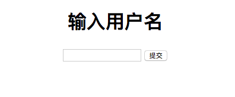

## 实现 URL 重定向

## 一、实验说明
### 1.1 实验内容
在上一节最后我们遗留了一个功能，也就是 `重定向`，导致最后在实战开发时只能构造一个带有链接的页面来手动跳转，这一节我们就来为框架添加自动跳转的 `重定向` 功能。

### 1.2 涉及知识点
* `URL 重定向`
* `HTTP 响应报头`

### 1.3 实验环境
* `Sublimt` 编辑器
* `Python3`
* `Xfce` 终端

### 1.4 实验步骤
* 理清什么是重定向
* 为框架实现重定向模块
* 实战重定向模块用法


## 二、什么是重定向
`URL 重定向` 其实就是 `URL` 的自动跳转，它的实现是在 `HTTP` 响应体中定义好 `Location` 参数，而客户端如果收到一个 `状态码` 为 `3xx` 类型的响应包，并且报头附带有 `Location` 参数，那么客户端会马上跳转到这个参数里面对应的 `URL` 去，大多数情况下，除了会有一小部分性能损失之外，这个操作对于用户来说是不可见的。

## 三、实现 URL 重定向模块
通过上面的概念知识可以知道，要实现重定向，其实只需要返回一个附带 `Location` 参数的响应包，并把要跳转的 `URL` 放进去就行，代码如下，定义在框架主体文件中
```python
...

# URL 重定向方法
def redirect(url, status_code=302):
    # 定义一个响应体
    response = Response('', status=status_code)

    # 为响应体的报头中的 Location 参数与 URL 进行绑定 ，通知客户端自动跳转
    response.headers['Location'] = url

    # 返回响应体
    return response
```

然后再在框架主体的 `dispatch_request` 中添加一个返回值判断，如果是 `Response` 则直接返回而不是走到最后的再次封装一个 `Response`
```python
...

# 我这里以实验楼名字缩写命名框架名字： “实验楼 Framework”
class SYLFk:
    ...

    # URL 路由
    def dispatch_request(self, request):
        ...
        
        # 定义 200 状态码表示成功
        status = 200
        # 定义响应体类型
        content_type = 'text/html'

        # 判断如果返回值是一个 Response 类型，则直接放回
        if isinstance(rep, Response):
            return rep

        # 返回响应体
        return Response(rep, content_type='%s; charset=UTF-8' % content_type, headers=headers, status=status)
```
## 四、实战 URL 重定向用法
回到上一节的 `SessionView` 定义的文件中，也就是 `core` 目录下的 `base_view.py` 文件，修改 `AuthLogin` 的 `auth_fail_callback`， 代码如下
```python
from sylfk import redirect
...

# 登录验证类
class AuthLogin(AuthSession):

    # 如果没有验证通过，则返回一个链接点击到登录页面
    @staticmethod
    def auth_fail_callback(request, *args, **options):
        return redirect("/login")
```

然后修改 `main.py` 文件的 `Login` 和 `Logout` 视图，代码如下
```python
from sylfk import redirect
...

# 登录视图
class Login(BaseView):
    def get(self, request):
        return simple_template("login.html")

    def post(self, request):
        # 从 POST 请求中获取 user 参数的值
        user = request.form['user']

        # 把 user 存放到当前会话中
        session.push(request, 'user', user)

        # 重定向到首页
        return redirect("/")


# 登出视图
class Logout(SessionView):
    def get(self, request):
        # 从当前会话中删除 user
        session.pop(request, 'user')

        # 重定向到首页
        return redirect("/")
```
运行
```
python3 main.py
```

可以看到当访问首页的 `URL` 时，会话中没有 `user` 就会自动跳转到登录页面


而登出的内部流程则其实是先访问首页的链接，再验证装饰器中验证失败，跳转的登录页面，并且在没登录的情况下访问“/logout”也会自动跳转到登录页面。

至此我们的重定向模块实现完毕。

## 五、总结
本节我们知道了重定向的原理与作用，并学会了如何去为框架实现一个重定向模块，下一章节我们将会涉及一个更贴近实际开发中经常使用到的技术 -- 前后端分离。
