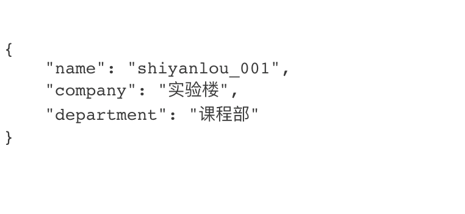

## 实现 JSON 数据格式化模块

## 一、实验说明
### 1.1 实验内容
上一节我们知道了数据与模版分离的开发流程，在 `Web` 开发流程中我们把数据模版分离是为了方便以后的跨平台开发和前后端技术员协作，所以我们需要选择一种友好的交互数据，即一种方便各个平台语言去操作的数据格式，它就是 `JSON`，这一节我们就为框架实现一个返回 `JSON` 数据的模块。

### 1.2 涉及知识点
* `json` 模块

### 1.3 实验环境
* `Sublimt` 编辑器
* `Python3`
* `Xfce` 终端

### 1.4 实验流程
* 理清 `JSON` 的概念
* 在 `Web 框架中` 实现 `JSON` 模块
* 实战使用这个 `JSON` 模块进行 `API` 开发

## 二、什么是 JSON
### 2.1 概念
官方的定义它是一种易于人阅读和编写，同时也易于机器解析和生成的轻量级的数据交换格式。

### 2.2 数据格式
`JSON` 的数据格式有两种，有序列表和键值对集合，在 `Python` 中类似的数据类型就是 `list`类型 和 `dict` 类型，并且两者可以嵌套使用，比如下面这串
```JSON
[
    {
        "name": "shiyanlou_001",
        "company": "实验楼",
        "department": "课程部"
    }
]
```

这里要注意的是，在 `JSON` 数据定义中，闭合字符串的字符非常严格，必须是美式的 `" "` 双引号，而不像 `Python` 中那样可以用 `" "` 双引号或者 `' '` 单引号。

### 2.3 基于 `HTTP 协议` 的使用方法
`HTTP 协议` 的响应报头中有一个 `Content-Type` 参数，这个参数的作用我们在第二章节有提过，就是指定客户端用什么数据类型渲染返回的内容，而 `JSON` 数据的 `Content-Type` 定义是 `application/json`，当返回的响应体报头的 `Content-Type` 是 `application/json` 时，客户端就可以识别出这段内容为 `JSON` 数据。

## 三、实现 JSON 模块
这一步我们准备实现一个封装内容为 `JSON` 数据的响应体的模块，代码如下，定义在框架主体文件中
```python
...

# 封装 JSON 数据响应包
def render_json(data):
    # 定义默认文件类型为纯文本
    content_type = "text/plain"

    # 如果是 Dict 或者 List 类型，则开始转换为 JSON 格式数据
    if isinstance(data, dict) or isinstance(data, list):

        # 将 data 转换为 JSON 数据格式
        data = json.dumps(data)

        # 定义文件类型为 JSON 格式
        content_type = "application/json"

    # 返回封装完的响应体
    return Response(data, content_type="%s; charset=UTF-8" % content_type, status=200)

```
代码的逻辑和 `URL 重定向` 的 `redirect` 其实思路差不多，都是封装一个独特的响应包来实现，包括下一节的文件下载，也就是服务器返回给客户端文件去下载的功能，也是通过封装一个独特的响应包来实现，下面我们现在实战测试下这个方法吧。

## 四、实战一个返回 JSON 数据的接口
在之前的 `main.py` 文件中添加一个 `API` 视图，该视图的 `get` 方法使用 `render_json` 函数返回 `JSON` 数据，并且在 `syl_url_map` 中关联视图与 `URL`，代码如下
```python
from sylfk import SYLFk, simple_template, redirect, render_json
...

class API(BaseView):
    def get(self, request):
        data = {
            'name': 'shiyanlou_001',
            'company': '实验楼',
            'department': '课程部'
        }

        return render_json(data)
...

syl_url_map = [
    {
        'url': '/',
        'view': Index,
        'endpoint': 'index'
    },
    {
        'url': '/login',
        'view': Login,
        'endpoint': 'test'
    },
    {
        'url': '/logout',
        'view': Logout,
        'endpoint': 'logout'
    },
    {
        'url': '/api',
        'view': API,
        'endpoint': 'api'
    }
]
...
```
运行
```bash
python3 main.py
```
然后访问“/api”这个 `URL`，可以看到页面已经返回 `JSON` 数据了



## 五、总结
本节我们知道了什么是 `JSON` 数据格式以及如何在 `HTTP` 通信中传输给客户端，并在框架中封装了一个返回 `JSON` 数据的模块，下一章节我们将继续学习如何返回一个文件让客户端进行下载。
