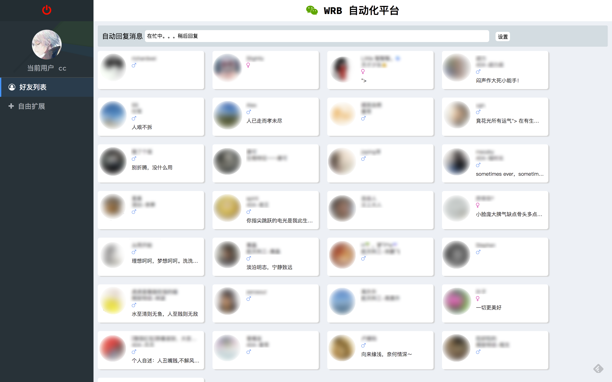

# 使用 Web 框架实战一个 Web 应用程序

## 一、实验说明
### 1.1 实验内容
这一章不会太多的知识讲解，因为大部分模块都在对应章节进行过实战了，这个项目是我用这个框架进行开发时的用法，所以专注项目结构，只贴代码不会讲业务逻辑，内容是使用框架实现一个轻量的 `Web` 版微信，实现的功能只有两个，分别是好友列表和自动回复，这个应用命名为 `WRB 自动化平台`，虽然我自己的版本里功能已经包含了非常非常多的模块，但这里只是要教同学们如何取使用这个框架，而且由于在实现过程中还需要读 `itchat` 这个库的源码并且做大量的修改，所以只抽出这两个功能，如果同学们有兴趣，我可以考虑之后再开一个课程来教大家。

### 1.2 涉及知识点
* `itchat`

### 1.3 实验环境
* `Python 3`
* `Xfce` 终端

### 1.4 环境配置
```bash
sudo pip3 install itchat
```

### 1.5 最终效果图


## 二、需求分析
说到网页版微信，首先要做的肯定是登录，登录成功之后我们要做的功能只有两个，一个是展示好友列表和自动回复消息，而这两个功能 `itchat` 其实也已经封装好了，我们只需要直接调就行了，下面就先来构建项目结构。

## 三、项目结构
先看下最终的目录结构
```bash
wechat_robot
├── config.py   # 项目配置文件
├── controller  # 控制器，每一个控制器都是一个包
│   ├── action  # action 控制器，下同不再赘述
│   │   ├── __init__.py # 包文件
│   │   ├── urls.py     # URL 绑定
│   │   └── views.py    # 视图逻辑
│   ├── index
│   │   ├── __init__.py
│   │   ├── urls.py
│   │   └── views.py
│   ├── login
│   │   ├── __init__.py
│   │   ├── urls.py
│   │   └── views.py
│   └── user
│       ├── __init__.py
│       ├── urls.py
│       └── views.py
├── core    # 核心模块
│   ├── base_view.py    # 视图模块
│   └── wechat_manager.py   # 微信模块
├── itchat    # itchat 模块，因为有修改源代码，所以直接拷贝副本放在项目里
├── main.py # 应用入口
├── message.dict    # 自动回复消息配置文件
├── static  # 静态资源文件
│   ├── fonts   # 字体目录
|   ├── head    # 微信登录用户所有图片目录
│   ├── image   # 页面图片资源目录
│   ├── index   # index 控制器资源目录
│   ├── login   # login 控制器资源目录
│   ├── public  # 公有资源目录
│   ├── qr_image    # 二维码图片目录
│   ├── skin    # layer 这个前端插件的样式皮肤目录
│   └── user    # user 控制器资源目录
└── template    # 模版文件
    ├── index   # index 控制器模版
    ├── login   # login 控制器模版
    └── user    # user 控制器模版
```
项目构建可能会比较繁琐，因为我的个人习惯就是尽可能分离，还是老槽点，为了后期的修改。

这里面要说的是 `itchat` 这个库要放在应用目录里，因为就这两个功能就对源码做了修改了，而这部分改动不是很大，只是在获取二维码时让它不弹出来而已，所以同学们只要注释掉对应弹出图片的代码就好了，在后面的小节里我会讲具体步骤。

## 四、实现两个核心模块
首先创建好项目之后，我这里项目目录名是 `wechat_robot`，然后把 `itchat` 拷贝当项目目录里
```bash
cp -R /usr/local/lib/python3.5/dist-packages/itchat wechat_robot
```
然后现在 `itchat` 下的 `utils.py` 文件中的 `print_qr` 方法内部内容注释掉
，如下
```python
...
def print_qr(fileDir):
'''
    if config.OS == 'Darwin':
        subprocess.call(['open', fileDir])
    elif config.OS == 'Linux':
        subprocess.call(['xdg-open', fileDir])
    else:
        os.startfile(fileDir)
'''
```

然后再次实现 `base_view.py`，再之前的实验中的那个文件内修改就行，下面是修改之后的 `base_view` 源码
```python
#!/usr/bin/env python
# encoding: utf-8

from sylfk import redirect
from sylfk.session import AuthSession, session, get_session_id
from sylfk.view import View

from core.wechat_manager import WeChat
import sylfk.exceptions as exceptions


class BaseView(View):
    methods = ['GET, POST']
    request = None
    session_id = None
    session_map = None
    wechat = None

    def post(self):
        pass

    def get(self):
        pass

    def dispatch_request(self, request, *args, **options):
        methods_meta = {
            'GET': self.get,
            'POST': self.post,
        }

        self.request = request
        self.session_id = get_session_id(request)
        self.session_map = session.map(request)

        if 'wechat' not in self.session_map:
            session.push(request, 'wechat', WeChat(), is_save=False)
            self.wechat = session.get(request, 'wechat')

        self.wechat = session.get(request, 'wechat')

        if request.method in methods_meta:
            return methods_meta[request.method]()
        else:
            raise exceptions.InvalidRequestMethodError


class AuthLogin(AuthSession):

    # 如果没有验证通过，则返回一个链接点击到登录页面
    @staticmethod
    def auth_fail_callback(request, *args, **options):
        return redirect("/login")

    # 验证逻辑，如果 user 这个键不在会话当中，则验证失败，反之则成功
    @staticmethod
    def auth_logic(request, *args, **options):
        if 'user' in session.map(request):
            return True
        return False


# 会话视图基类
class SessionView(BaseView):

    # 验证类抓装饰器
    @AuthLogin.auth_session
    def dispatch_request(self, request, *args, **options):
        # 结合装饰器内部的逻辑，调用继承的子类的 dispatch_request 方法
        return super(SessionView, self).dispatch_request(request, *args, **options)
```
这份代码里面从 `core.wechat_manager` 导入了 `WeChat`，而且为了方便开发，把 `session`、`request` 相关的内容都提前取出来了，在实现 `get` 这种方法时就可以直接用 `self.reqeust` 的方式来获取请求信息了，其它以此类推，下面来看 `core.wechat_manager` 的实现，跟框架的实现关系不大，所以代码不会解释
```python
import json
import os
import threading
from multiprocessing.pool import ThreadPool

import itchat
from config import message_dict


sex_map = {
    '1': 'fa-mars',
    '2': 'fa-venus'
}


class WeChat:
    def __init__(self):
        self.wechat = itchat.new_instance()
        self.storageClass = self.wechat.storageClass
        self.get_friends = self.wechat.get_friends
        self.msg_register = self.wechat.msg_register
        self.TYPE = itchat.content.INCOME_MSG
        self.friend_list = []

        self.is_logging = False

        if not os.path.exists(message_dict):
            self.message_map = {}
            with open(message_dict, 'w') as f:
                f.write(json.dumps(self.message_map))
        else:
            with open(message_dict, 'r') as fr:
                self.message_map = json.loads(fr.read())

    def save_message_config(self):
        with open(message_dict, 'w') as fw:
            fw.write(json.dumps(self.message_map))

    def download_head(self, path, filename):
        rep = self.wechat.s.get('https://wx2.qq.com' + path, stream=True)

        path = os.path.join('static', 'head', self.wechat.storageClass.nickName)

        if not os.path.exists(path):
            os.mkdir(path)

        with open(os.path.join(path, filename), 'wb') as f:
            f.write(rep.content)

    def login(self, s, request):

        def do():
            self.is_logging = True
            while True:
                s.push(request, 'status', self.wechat.check_login())
                if s.get(request, 'status') == '200':
                    break
            self.wechat.web_init()
            self.wechat.show_mobile_login()
            self.wechat.get_contact(True)
            self.wechat.start_receiving()

            self.download_head(self.wechat.storageClass.headImgUrl, 'user.jpeg')

            self.init_replay(s, request)
            self.init_friends()

            self.wechat.run()

        if not self.is_logging:
            threading.Thread(target=do).start()

    def get_qrcode(self, path):
        self.wechat.get_QRuuid()
        self.wechat.get_QR(picDir=path)

    def logout(self):
        self.wechat.logout()

    def init_replay(self, s, request):
        @self.wechat.msg_register(self.TYPE)
        def replay(message):
            self.wechat.send(self.message_map['auto_replay'], message['FromUserName'])

    def init_friends(self, s, request):
        friends = self.wechat.get_friends(update=True)

        pool = ThreadPool(processes=15)
        for friend in friends[1:]:
            data = {}

            path = os.path.join('static', 'head', self.storageClass.nickName, friend['NickName'].replace(" ", '') + '.jpeg')
            if not os.path.exists(path):
                pool.apply_async(self.download_head, (friend['HeadImgUrl'], friend['NickName'].replace(" ", '') + '.jpeg'))

            data['image_url'] = '/static/head/{user}/{nick_name}.jpeg'.format(user=self.storageClass.nickName, nick_name=friend['NickName'].replace(" ", ''))
            data['nick_name'] = friend['NickName']
            data['mark_name'] = friend['RemarkName']
            data['sex'] = sex_map.get(str(friend['Sex']), '')
            data['province'] = friend['Province']
            data['city'] = friend['City']
            data['signature'] = friend['Signature']
            data['user_name'] = friend['UserName']

            self.friend_list.append(data)
        s.push(request, 'is_login', True)

    def get_friend_list(self):
        return self.friend_list

```

下面就来看看实现 `login` 控制器的登录模块，以此来分析控制器的实现和结构

### 五、控制器分析
来看看控制器的目录结构
```bash
login
 ├── __init__.py
 ├── urls.py
 └── views.py
```
这里是把 `URL` 和视图分开了，先来看看 `__init__.py` 中的代码
```python
from sylfk.view import Controller

from controller.login.urls import url_maps

controller = Controller('login_controller', url_maps)
```
包代码其实就只是从 `urls.py` 加载 `url_maps` 而已，接着看 `urls.py`，里面是定义了 `URL` 与 视图的绑定
```python
from controller.login import views


url_maps = [
    {'url': '/login', 'view': views.Login, 'endpoint': 'login'},
    {'url': '/logout', 'view': views.Logout, 'endpoint': 'logout'},

    {'url': '/api/get_qrcode', 'view': views.GetQrCode, 'endpoint': 'get_qrcode'},
    {'url': '/api/check_login', 'view': views.CheckLogin, 'endpoint': 'check_login'}
]
```
可以看到视图和 `URL` 的绑定都写在对应包的 `urls.py` 中，视图则是对应包的 `views.py` 中，做到分离，方便后期修改，最后再看一下 `views.py` 中的代码
```python
from sylfk import simple_template, render_json, redirect
from sylfk.session import session

from core.base_view import BaseView, SessionView


class Login(BaseView):
    def get(self):
        if 'user' in self.session_map:
            return redirect("/")

        return simple_template("login/login.html")


class Logout(SessionView):
    def get(self):
        self.wechat.logout()
        session.pop(self.request, 'user')
        session.pop(self.request, 'status')
        session.pop(self.request, 'is_login')
        session.pop(self.request, 'wechat')

        return redirect("/login")


class GetQrCode(BaseView):
    def get(self):
        image_path = "static/qr_image/{session_id}.png".format(session_id=self.session_id)
        self.wechat.get_qrcode(image_path)
        self.wechat.login(session, self.request)

        return render_json({
            'ok': 1,
            'image_url': '/' + image_path
        })


class CheckLogin(BaseView):
    def get(self):

        message_map = {
            '200': '登录成功，跳转中。。。',
            '201': '请在手机微信上验证'
        }

        ok = int(self.session_map.get('status', 0))

        if self.session_map.get('status') == '200' and self.session_map.get('is_login'):
            session.push(self.request, 'user', self.wechat.storageClass.nickName)
            ok = 1

        return render_json({
            'ok': ok,
            'message': message_map.get(self.session_map.get('status'), '请扫码登录')
        })
```
至此，项目分析就到一段落了，下面是源码的连接，有兴趣的同学可以下去看看
