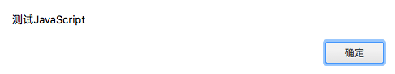

## 实现 URL 路由追踪

## 一、实验说明
### 1.1 实验内容
本节内容主要针对继上一节还没实现的 `dispatch_request` 方法，做到根据不同的 `URL` 路径返回不同的结果。

### 1.2 涉及知识点
* `URL` 路由

### 1.3 实验环境
* `Python3`
* `Sublimt` 编辑器
* `Xfce` 终端

### 1.4 实验流程
* 设计路由功能
* 实现规则绑定
* 运行测试

## 二、实现路由追踪
### 2.1 设计流程
首先我们要做的事情很简单，就是从请求中判断客户端想获取的 `URL` 资源，然后再到对应或者说绑定的函数中获取处理结果，那么我们就需要先建立映射关系，而通过之前的框架整体设计中能知道，我们不仅有路由，还有视图，而且实际开发中还存在静态资源，也就是图片、`CSS` 文件和 `JS` 文件，再加上以后的未知类型的扩展，所以我们需要再把处理函数封装为一个有类型标识的数据结构，确定好之后下面我们就来开始实现。

### 2.2 定义处理逻辑数据结构
这个数据结构我们需要三个成员，一是执行函数，二是附带的参数，三是结构类型，直接定义在框架主体文件中，代码如下

```python
...

# 处理函数数据结构
class ExecFunc:
    def __init__(self, func, func_type, **options):
        self.func = func            # 处理函数
        self.options = options      # 附带参数
        self.func_type = func_type  # 函数类型


# 我这里以实验楼名字缩写命名框架名字： “实验楼 Framework”
class SYLFk:
  ...
```

### 2.3 建立映射关系
这里为了低耦合度，方便开发中模块话，我们需要为处理函数结构命名，实际开发中就可以先写好模块，到了需要替换时就可以直接替换与 `URL` 版定的 `节点名` 中的模块来达到更改处理逻辑，提高模块的复用性，所以其实我们一共需要三个映射关系，第一个是绑定 `URL` 与处理函数的 `节点名`，第二个是版定 `节点名` 与处理函数结构体也就是 `ExecFunc` 的实例，第三个绑定是静态资源文件内容与 `静态资源 URL`，全都定义在框架主体的 `__init__` 方法中，代码如下

```python
import os
...

# 我这里以实验楼名字缩写命名框架名字： “实验楼 Framework”
class SYLFk:
    def __init__(self, static_folder='static'):
        self.host = '127.0.0.1'  # 默认主机
        self.port = 8080  # 默认端口
        self.url_map = {} # 存放 URL 与 Endpoint 的映射
        self.static_map = {} # 存放 URL 与 静态资源的映射
        self.function_map = {} # 存放 Endpoint 与请求处理函数的映射
        self.static_folder = static_folder # 静态资源本地存放路径，默认放在应用所在目录的 static 文件夹下
```

### 2.4 实现规则绑定函数
我们先来看代码再分析逻辑，函数定义在框架主体中，代码如下

```python
import sylfk.exceptions as exceptions
...

# 我这里以实验楼名字缩写命名框架名字： “实验楼 Framework”
class SYLFk:
    ...

    # 添加路由规则
    def add_url_rule(self, url, func, func_type, endpoint=None, **options):

        # 如果节点未命名，使用处理函数的名字
        if endpoint is None:
            endpoint = = func.__name__

        # 抛出 URL 已存在异常
        if url in self.url_map:
            raise exceptions.URLExistsError

        # 如果类型不是静态资源，并且节点已存在，则抛出节点已存在异常
        if endpoint in self.function_map and func_type != 'static':
            raise exceptions.EndpointExistsError

        # 添加 URL 与节点映射
        self.url_map[url] = endpoint

        # 添加节点与请求处理函数映射
        self.function_map[endpoint] = ExecFunc(func, func_type, **options)
```

可以看到在规则添加函数里使用了两个异常，是在 `exceptions` 包中导入的，所以我们先到 `exceptions` 这个包里看看异常的实现

```python
# 框架异常基类
class SYLFkException(Exception):
    def __init__(self, code='', message='Error'):
        self.code = code        # 异常编号
        self.message = message  # 异常信息

    def __str__(self):
        return self.message     # 当作为字符串使用时，返回异常信息


# 节点已存在存在
class EndpointExistsError(SYLFkException):
    def __init__(self, code='', message='Endpoint exists'):
        super(EndpointExistsError, self).__init__(code, message)


# URL 已存在异常
class URLExistsError(SYLFkException):
    def __init__(self, code='', message='URL exists'):
        super(URLExistsError, self).__init__(code, message)

```
这两个异常很简单，只是抛出一个消息而已，异常处理的详细用法我会放在整个功能性模块全部开发完之后，对框架进行善后处理时再来进行详细讲解。然后我们接着函数的参数，第一个是要绑定的 `URL` ，第二个是 `执行函数`，第三个是 `执行函数类型`，第四个是 `节点名`。

接着我们分析整个下函数的逻辑，当 `URL` 和静态类型以外的 `节点` 名都没有被绑定时，先绑定 `URL` 与 `节点`，再绑定 `节点` 与 `处理函数对象`。

### 2.5 实现静态资源规则绑定函数与静态资源路由
依旧是先来看一下相关的代码逻辑，再来分析

`helper` 包代码
```python
# 以“.”分割文件名，获取文件后缀类型
def parse_static_key(filename):
    return filename.split(".")[-1]
```

框架主体文件代码
```python
...

from sylfk.helper import parse_static_key
...

# 定义常见服务异常的响应体
ERROR_MAP = {
    '401': Response('<h1>401 Unknown or unsupported method</h1>', content_type='text/html; charset=UTF-8', status=401),
    '404': Response('<h1>404 Source Not Found<h1>', content_type='text/html; charset=UTF-8', status=404),
    '503': Response('<h1>503 Unknown function type</h1>', content_type='text/html; charset=UTF-8',  status=503)
}

# 定义文件类型
TYPE_MAP = {
    'css':  'text/css',
    'js': 'text/js',
    'png': 'image/png',
    'jpg': 'image/jpeg',
    'jpeg': 'image/jpeg'
}
...

# 我这里以实验楼名字缩写命名框架名字： “实验楼 Framework”
class SYLFk:

    # 静态资源调路由
    def dispatch_static(self, static_path):
        # 判断资源文件是否在静态资源规则中，如果不存在，返回 404 状态页
        if os.path.exists(static_path):
            # 获取资源文件后缀
            key = parse_static_key(static_path)

            # 获取文件类型
            doc_type = TYPE_MAP.get(key, 'text/plain')

            # 获取文件内容
            with open(static_path, 'rb') as f:
                rep = f.read()

            # 封装并返回响应体
            return Response(rep, content_type=doc_type)
        else:
            # 返回 404 页面为找到对应的响应体
            return ERROR_MAP['404']
    ...
```

从 `dispatch_static` 这个方法的名字看就可以得知它是静态资源 `URL` 的路由，用来选招匹配的 `URL` 并返回对应类型和文件内容封装成的响应体，如果找不到则返回 `404` 状态页。

这里有个要点，静态资源是要在服务器启动的时候预先加载好的，所以在启动函数 `run` 中我们要把静态资源相关的节点函数命名为 `static`， 并且绑定处理方法为 `dispatch_static` 代码如下
```python
...

# 我这里以实验楼名字缩写命名框架名字： “实验楼 Framework”
class SYLFk:
    ...
    def run(self, **options):
    ...
    # 映射静态资源
    self.add_static_rule(self.static_folder)

    # 映射静态资源处理函数，所有静态资源处理函数都是静态资源路由
    self.function_map['static'] = ExecFunc(func=self.dispatch_static, func_type='static')
    ...
```
### 2.6 实现 URL 路由追踪函数
路由的本质就是要找到 `URL` 对应的处理函数，负责的事情就是分析请求的 `URL`，找到对应的节点名，在找到对应的 `处理函数对象`，这里每一行代码都加了注释，并且逻辑也不复杂，故不再详细讲解，如果还有疑问可以到提问板块提出，代码如下
```python

# 我这里以实验楼名字缩写命名框架名字： “实验楼 Framework”
class SYLFk:
    ...

    # URL 路由
    def dispatch_request(self, request):
        # 去掉 URL 中 域名部分，也就从 http://xxx.com/path/file?xx=xx 中提取 path/file 这部分
        url = "/" + "/".join(request.url.split("/")[3:]).split("?")[0]

        # 通过 URL 寻找节点名
        if url.find(self.static_folder) == 1 and url.index(self.static_folder) == 1:
            # 如果 URL 以静态资源文件夹名首目录，则资源为静态资源，节点定义为 static
            endpoint = 'static'
            url = url[1:]
        else:  
            # 若不以 static 为首，则从 URL 与 节点的映射表中获取节点
            endpoint = self.url_maps.get(url, None)

    # 定义响应报头，Server 参数的值表示运行的服务名，通常有 IIS， Apache，Tomcat，Nginx等，这里自定义为 SYL Web 0.1
    headers = {'Server': 'SYL Web 0.1'}

    # 如果节点为空 返回 404
    if endpoint is None:
        return ERROR_MAP['404']

    # 获取节点对应的执行函数
    exec_function = self.function_map[endpoint]

    # 判断执行函数类型
    if exec_function.func_type == 'route':
        """ 路由处理 """  

        # 判断请求方法是否支持
        if request.method in exec_function.options.get('methods'):
            """ 路由处理结果 """

            # 判断路由的执行函数是否需要请求体进行内部处理
            argcount = exec_function.func.__code__.co_argcount

            if argcount > 0:
                # 需要附带请求体进行结果处理
                rep = exec_function.func(request)
            else:
                # 不需要附带请求体进行结果处理
                rep = exec_function.func()
        else:
            """ 未知请求方法 """

            # 返回 401 错误响应体
            return ERROR_MAP['401']
    elif exec_function.func_type == 'static':
        """ 静态逻辑处理 """

        # 静态资源返回的是一个预先封装好的响应体，所以直接返回
        return exec_function.func(url)
    elif exec_function.func_type == 'view':
        """ 视图处理逻辑 """
        pass
    else:
        """ 未知类型处理 """

        # 返回 503 错误响应体
        return ERROR_MAP['503']

    # 定义 200 状态码表示成功
    status = 200
    # 定义响应体类型
    content_type = 'text/html'

    # 返回响应体
    return Response(rep, content_type='%s; charset=UTF-8' % content_type, headers=headers, status=status)
    ...
```

这里需要注意的是判断执行函数类型的代码块中，有一个我们还没实现的处理函数类型 `view` 类型，会在第9节中再详细介绍。

### 2.7 路由装饰器
使用过 `flask` 这个框架的同学可能会对路由装饰器比较熟悉，它的用法如下
```python
app = Flask(__name__)

@app.route('/', methods=['GET'])
def index():
    return 'Hello, World'
```

这里我们就是要实现一个类似的装饰器，代码定义在 `route` 包下
```python
# 路由装饰器
class Route:
    def __init__(self, app):
        # 传入应用（框架）实例
        self.app = app

    # 实现 call 方法
    def __call__(self, url, **options):
        # 若果 methods 参数没有定义，则初始化为仅支持 GET 方法
        if 'methods' not in options:
            options['methods'] = ['GET']

        def decorator(f):
            # 调用应用内部的 add_url_url 添加规则
            self.app.add_url_rule(url, f, 'route', **options)
            return f

        return decorator
```

然后在框架主体文件中初始化一个 `route` 成员，赋值为 `Route` 实例
```python
from sylfk.route import Route
...

# 我这里以实验楼名字缩写命名框架名字： “实验楼 Framework”
class SYLFk:

    def __init__(self, static_folder='static'):
      ...
      self.route = Route(self)  # 路由装饰器

    ...
```

### 2.8 测试路由效果
回到上一节的 `main.py` 文件，将里面的代码添加以下内容
```python
from sylfk import SYLFk


app = SYLFk()

@app.route('/index', methods=['GET'])
def index():
    return '这是一个路由测试页面'


@app.route("/test/js")
def test_js():
   return '<script src="/static/test.js"></script>'

app.run()
```
并在同目录下创建 `static` 文件夹，里面添加一个 `test.js` 文件，文件内的 `JavaScript` 代码为
```javascript
alert('测试JavaScript');
```

然后运行它，访问“/”这个 `URL` 会发现返回如图 `404` 错误


访问“/index”则会返回“这是一个路由测试页面”


访问“/test/js”，这会弹出一个框，里面内容为“测试JavaScript”



## 三、总结
通过本节，我们知道了一个 `Web 框架` 中什么是路由，了解了路由的工作流程，学会了对 `Web 框架` 中路由这个功能的内部内部的实现。
