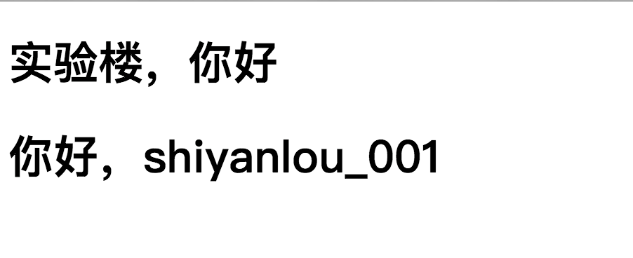

## 实现一个简单的模版引擎

## 一、实验说明
### 1.1 实验内容
基于上一节的内容，实现 `MVC 范式` 最后的界面分离。

### 1.2 涉及知识点
* `MVC 设计模式`
* 模版引擎
* 正则表达式 `re` 模块


### 1.3 实验环境
* `Sublimt` 编辑器
* `Python3`
* `Xfce` 终端

### 1.4 实验步骤
* 理清模版引擎的概念
* 设计模版引擎结构
* 实现模版引擎对应模块
* 实战完整基于 `MVC 设计模式` 的开发范式


## 二、模版引擎的概念
模版引擎的产生就是为了让用户界面与业务逻辑分离开来，比如我们之前的视图，它最终还没有实现到业务逻辑与用户界面分开，因为最后的返回结果就是一个 `HTML` 字符串，而在 `MVC 设计模式` 中，这些内容与处理函数内部的业务逻辑应该是分开来的，所以这一节我们就来实现它。

## 三、模版引擎的种类
模版引擎大致分为三种，有置换型，解释型和编译型，这次学习我们只接触置换型，故对后面两种不做赘述，有兴趣的同学可以自行了解。

## 四、实现置换型模版引擎
### 4.1 什么是置换型模版引擎
置换型模版引擎就是对模版文件内容中特殊标记的地方，用对应的内容数据进行替换。

### 4.2 实现置换型模版引擎
首先我们先定以下大致的结构，从上一小节可以知道第一个必须的就是特殊标记，然后就是一个能从文件内容找找出特殊标记的解析函数，再之后就是一个置换内容的函数，现在明确我们的三个需求，就来看看实现，代码定义在 `template_engine` 包中

首先就是定义模版标记，这里我选用与主流模版引擎 `Jinja2` 相同的标记
```python
import os
import re


# 模版标记
pattern = r'{{(.*?)}}'
```

接下来是用正则匹配出所有的模版标记的解析函数，如果有找到标记则返回反之返回一个空的 `tuple`
```python
...

# 解析模版
def parse_args(obj):
    # 获取匹配对象
    comp = re.compile(pattern)

    # 查找所有匹配的结果
    ret = comp.findall(obj)

    # 如果匹配结果不为空，返回它，为空则返回一个空的 tuple
    return ret if ret else ()
```

最后就是置换函数，置换函数的逻辑是先读取模版文件内容，再找出所有的标记进行内容替换
```python
...

# 返回模版内容
def replace_template(app, path, **options):
    # 默认返回内容，当找不到本地模版文件时返回
    content = '<h1>Not Found Template</h1>'

    # 获取模版文件本地路径
    path = os.path.join(app.template_folder, path)

    # 如果路径存在，则开始解析置换
    if os.path.exists(path):

        # 获取模版文件内容
        with open(path, 'rb') as f:
            content = f.read().decode()

        # 解析出所有的标记
        args = parse_args(content)

        # 如果置换内容不为空，开始置换
        if options:
            # 遍历所有置换数据，开始置换
            for arg in args:
                # 从标记中获取键
                key = arg.strip()

                # 如果键存在于置换数据中，则进行数据替换，反之替换为空
                content = content.replace("{{%s}}" % arg, str(options.get(key, '')))

    # 返回模版内容
    return content
```
通过这段代码可以看到 `replace_template` 方法中的第一个参数是应用本身，第二个参数是路径，而内部的 `path` 其实是由应用本身的 `template_folder` 属性与指定路径结合而成的，所以回到框架主体文件，我们需要定义好这个 `template_folder` 属性
```python
...

# 我这里以实验楼名字缩写命名框架名字： “实验楼 Framework”
class SYLFk:
    # 类属性，模版文件本地存放目录
    template_folder = None

    def __init__(self, static_folder='static', template_folder='template'):
        self.host = '127.0.0.1'  # 默认主机
        self.port = 8080  # 默认端口
        self.url_map = {} # 存放 URL 与 Endpoint 的映射
        self.static_map = {} # 存放 URL 与 静态资源的映射
        self.function_map = {} # 存放 Endpoint 与请求处理函数的映射
        self.static_folder = static_folder # 静态资源本地存放路径，默认放在应用所在目录的 static 文件夹下

        self.template_folder = template_folder # 模版文件本地存放路径，默认放在应用所在目录的 template 目录下
        SYLFk.template_folder = self.template_folder # 为类的 template_folder 也初始化，供上面的置换模版引擎调用
    ...
```

之后再结合模版引擎模块，实现一个接口
```python
from sylfk.template_engine import replace_template
...

# 我这里以实验楼名字缩写命名框架名字： “实验楼 Framework”
class SYLFk:
    ...

# 模版引擎接口
def simple_template(path, **options):
    return replace_template(SYLFk, path, **options)
```

### 五、实战真正的 MVC 范式开发
首先在 `main.py` 文件同级目录下创建一个 `template` 文件夹，里面在生成一个 `index.html` 文件，文件内容如下
```html
<!DOCTYPE html>
<html>
  <head>
    <meta charset="UTF-8" />
    <title>实验楼</title>
  </head>
  <body>
    <h1>{{ message }}</h1>
    <h1>你好，{{ user }}</h1>
  </body>
</html>
```

然后回到 `main.py` 文件，修改 `Index` 类的 `get` 方法为如下内容，记得从导入上面刚刚实现的 `simple_template` 方法
```python
from sylfk import SYLFk, simple_template
...

class Index(BaseView):
    def get(self, request):
        return simple_template("index.html", user="shiyanlou_001", message="实验楼，你好")
...
```
运行它，访问“/shiyanlou/”可以看到页面返回如下结果


至此，我们完成了业务逻辑与用户界面分离，数据与用户界面分离，实现了完整的 `MVC 设计模型` 的开发范式支持。

### 六、总结
本节我们继上一节剩下的最后一个代码分离功能做了实现，学了了如何实现一个置换型模版引擎，完整的支持了 `MVC` 开发范式，下一节我们将开始另一个必备模块的开发，关于 `HTTP` 中的会话维持功能。
